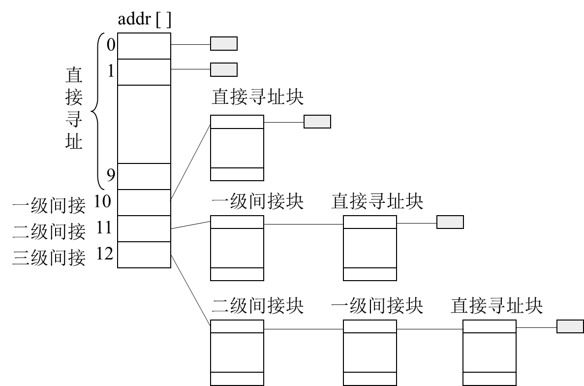

# NIE2334_2024-2025-2

## 操作系统概述

- 操作系统的概念
    - 操作系统是控制和管理计算机系统内各种硬件和软件资源、有效地组织多道程序运行的系统软件（或程序集合），是用户与计算机之间的接口。
- 操作系统的要点
    - 是软件，且是系统软件
    - 基本职能是控制和管理系统资源
    - 提供服务，方便用户使用
- 输入输出
    - 缓冲技术
        - 处于CPU和外设之间，解决速度不匹配问题
        - 例如，SPOOLING（Simultaneous Peripheral Operation On-Line，即外部设备联机并行操作）技术将磁盘模拟成IO设备，也称为假脱机。
            - 缓和了CPU与低速I/O设备速度不匹配的矛盾
            - 设备并没有分配给任何进程.在输入井或输出井中，分配给进程的是一存储区和建立一张I/O请求表
            - 实现了虚拟设备功能.多个进程同时使用一独享设备，而对每一进程而言，都认为自己独占这一设备，不过，该设备是逻辑上的设备
    - 中断技术
        - 解决CPU和外设的协调 (不再需要轮询外设状态)
    - DMA技术
        - 进一步解放CPU
- 操作系统的类型
    - 分时系统
    - 实时系统
    - 微机操作系统
    - 网络操作系统
    - 分布式操作系统
- 操作系统的特征
    - 并发
    - 共享
    - 虚拟
    - 不确定性
- 现代操作系统的新特征
    - 微内核体系结构
    - 多线程
    - 对称多处理
    - 分布式
    - 面向对象设计
- 操作系统的功能
    - 处理机管理（进程调度）
    - 存储管理
    - 设备管理
    - 文件管理
    - 用户接口

## 内存管理
### 内存管理的概念
- 作用：提高主存的利用率，将尽可能多的作业同时加载到主存中
- 层次：
    - 寄存器
    - 主存
    - 辅助存储器
- 需求：
    - 重定位：进程装入内存中的地址变化 （不固定）
    - 保护：防止进程越界访问
    - 共享：对共享区域的受控访问
    - 逻辑组织：逻辑地址的组织更符合程序的构造
    - 物理组织：管理主存、辅存等分级存储方式

### 存储管理技术
- 单一连续区（不分区）
- 固定分区
    - 大小一致
    - 大小不一致
- 动态可变分区
    - 不会产生内部碎片
- 单纯分页/分段
- 虚拟存储系统
    - 分页
    - 分段
    - 段页式

#### 地址重定位
- 固定定位
- 静态重定位
- 动态重定位
    - 将逻辑地址变换成物理地址由硬件自动完成
    - 优点：
        - 运行期间可以换进换出内存：换出阻塞的进程
        - 可以在内存中移动进程：搜集内存中的外部碎片
        - 空间不必连续
        - 便于信息共享
        - 是内存虚拟管理的基础

#### 动态可变分区分配算法
- 首次适配（First）：空闲分区链表按地址排序，分配快，回收效率高，小碎片多
- 临近适配（Next）：从上次分配的地址开始查找，减少搜索时间
- 最佳适配（Best）：空闲分区链表按块从小到大排序，选择最小的足够大的空闲分区，小碎片多
- 最差适配（Worst）：空闲分区链表按块从大到小排序，选择最大的空闲分区，多中等碎片
- 算法对比
    - 复杂度：最佳（2+2）> 最差（1+2）>首次（1+1）>循环（1+1）
    - 小碎片产生的可能性：最佳 >首次 > 循环 > 最差
    - 后继大作业分配成功的可能性：最佳 >首次 > 循环 > 最差

#### 内存扩充技术
- 主辅存交换
    - 覆盖技术：
        - 用于一个作业的内部
        - 同一程序按程序的逻辑结构分段，不会同时运行的程序段分在一组内，该组称为覆盖段
        - 极端情况下覆盖段在主存中只保留一个段，其他段在辅存中
        - 应用程序不透明，需要程序员干预
    - 交换技术（虚拟存储技术）：
        - 用于不同的作业，任一时刻主存中只保留一个完整的用户作业
        - 对应用程序而言是透明的，无需程序员干预

#### 虚拟存储技术
- 简单分页——页表（page table）
    - 逻辑地址到物理地址的转换：
        - 逻辑地址 = 页号 + 页内偏移
        - 物理地址 = 帧号 + 页内偏移
- 系统抖动：频繁换入换出页面
- 虚拟存储器的大小限制：
    - 存放程序指令和数据的外存区域称为交换区。
    - 虚拟存储器大小 = 交换区大小 + 内存大小
- 虚拟地址空间大小：
    - 计算机地址结构的限制（例如，指令地址字长度等）
- 地址映射
    - 将进程中程序的虚拟（逻辑）地址转化为物理地址
    - 维护地址映射表
- 物理内存的管理
    - 物理内存的回收、分配
- 缺页异常的处理
    - 分配内存
    - 将需要的内容从磁盘swap区加载到内存
- 页大小
    - 页越大，内零头越大；
    - 页越小，需要的页越多，页表就越大

#### 逻辑地址到物理地址的转换
- 页表（page table）
    - 逻辑地址 = 页号 + 页内偏移
    - 物理地址 = 帧号 + 页内偏移

    
- 快表（TLB：Translation Lookaside Buffer）
    - 页表在Cache或寄存器中的副本
    - 用于加速地址转换

    
- 多级页表
    - 把整个页表进行分页，分成一张张小页表，每个小页表的大小与页框相同。
    - 对小页表顺序编号，允许小页表分散存放在不连续的页框中。
    - 为了进行索引查找，应该为这些小页表建一张页目录表（一级页表），其表项指出小页表（二级页表）所在页框号及相关信息。
    - 逻辑地址结构有三部分组成：页目录号、页号和位移。
    
    
    
- 反向页表（Inverted Page Table）
    - 虚拟地址的页号使用散列函数映射到哈希表中。
    - 把 $n$ 位页号映射到 $m$ 位帧号（$n > m$）
    - 大小与物理内存成正比
        
    

### 空闲内存页的管理
- 位图方式：
    - 每个Bit表示一块的使用状态。0表示空闲，1表示已分配。
    - 表示能力：32MB主存，页大小为4K，1KB的空间就足够表示。
    - 效率高：只要修改对应bit就可以
- 空闲链表方式：
    - 用链结构表示空闲页。

### 物理页框回收
- 全局淘汰策略：从所有作业所占用的帧中选择。
- 局部淘汰策略：从本作业所占用的帧中选择

#### 淘汰算法
1. 最优淘汰算法（OPT-Optimal）
    - 淘汰将来最长时间不使用的页面。
    - 需要预知未来的页面访问情况，实际不可行。
    - 作为理论上的评价标准，用以鉴别其他淘汰算法的优劣
2. 先进先出淘汰算法（FIFO）
    - 淘汰最先进入内存的页面。
    - 实现简单。
    - 可能导致系统抖动（频繁换入换出页面）。
3. 最近最少未使用算法（LFU-Least Frequently Used）
    - 淘汰在一定时间内未被访问的页面。
    - 为每页面设置访问计数器，通过比较所有页的计数器值来确定淘汰的页面。
    - 需要定期对计数器清零，以淘汰过期页
    - 过于复杂
4. 最久不使用淘汰算法（NUR-Not Used Recently），即Clock算法
    - 结合了FIFO和LFU的思想。
    - 1个访问位
        - 每个页面有一个访问位，表示最近是否被访问过。
        - 使用一个指针指向当前检查的页面，按顺序检查页面。
        - 如果访问位为1，则清零并继续检查下一个页面；如果为0，则淘汰该页面。
    - 1个访问位 + 1个修改位
        - 每个页面有一个访问位和一个修改位。
        - 访问位表示最近是否被访问过，修改位表示页面是否被修改过。
        - 使用一个指针指向当前检查的页面，按顺序检查页面。
        - 如果访问位为1，则清零并继续检查下一个页面；如果为0，则淘汰该页面。
    - 适用于大多数实际情况，性能较好。

### 段页式虚拟存储管理
- **虚拟分段的优点**：
    - 简化不断增长的数据结构处理方式
    - 允许分块编译
    - 有助于进程间的共享
    - 有助于实现保护机制
- 段页式地址翻译 
    - 段号 $s$ + 页号 $p$ + 页内偏移 $d$
    - 为了进行地址变换，系统为每一个作业建立一张段表，再为每一段建立一张页表。同样，也有一个段表控制寄存器，存放当前作业段表的长度和始址。

    
- 读取策略
    - 请求式分页
    - 预约式分页
- 放置策略
    - 最佳适配
    - 首次适配
    - 近邻适配
    - 最差适配
- 替换策略
    - 算法
        - Opt
        - FIFO
        - LRU
        - Clock（NRU）
    - 页缓冲
- 清除策略（回写）
    - 请求式清除
    - 预约式清除

### 物理主存储器的分配和管理
- 伙伴系统（Buddy system）
    - 将内存分成大小为 $2^n$ 的块。
    - 分配时，寻找最小的满足要求的块。
    - 回收时，将相邻的块合并成更大的块。
    - 优点：减少碎片，提高内存利用率。

    ```c
    Void get_hole( int i)
    {
    If ( i == ( u+1) ) failure;
    If ( <i_list empty> )
    {
    get_hole( i+1);
    <split hole into buddies>;
    <put buddies on i_list>;
    }
    <take first hole on i_list>;
    }
    ```
    
- Slab系统
    - 将内存分成多个大小相同的块（slab）。
    - 每个 slab 包含多个对象，每个对象大小相同。
    - 对象分配和回收时，直接在 slab 中进行，不需要频繁的内存分配和释放。
    - 优点：减少碎片，提高内存利用率。

    
- SLUB：在 SLAB 的基础上简化设计，提高性能。更适合多处理器系统使用。是目前Linux版本的默认配置。
- SLOB：为嵌入式系统提供极简的内存分配方案。

## 进程管理
### 进程概念
- 进程的概念
    - 程序在操作系统上的一次运行过程。
    - 系统进行资源分配和调度的一个可并发执行的独立单位。
    - 在进程看来，自己独占计算机系统，并可以调用OS提供的服务。
- 进程的特性
    - 动态性：进程具有生命周期，经历创建、运行、消亡等过程。
    - 并发性：多个进程可以并发地执行。
    - 独立性：进程既是系统中资源分配和保护的基本单位，也是系统调度的独立单位。
- 进程的组成
    - 代码段：或叫共享正文段，在多个程序间可以实现共享。含代码和不变的数据。
    - 数据上下文：
        - 用户层：
            - 数据区：外部变量和静态变量
            - 工作区：即栈，包含局部变量，函数调用的现场。
        - 操作系统层：执行现场和核心栈
        - 寄存器层：控制寄存器和数据寄存器。
- 进程控制块(PCB)
    - 进程的基本信息和状态信息的集合。
    - **每个进程有且仅有一个进程控制块。**
    - 分为两部分：
        - 常驻内存部分：进程无论处于什么状态，系统都可能要查询的PCB成员。
        - 可交换部分：进程不在执行时系统不需要访问的PCB成员。内存紧张时可以将他们换出到磁盘上。
- 进程是程序的一次动态执行活动，而程序是进程运行的静态描述文本

### 进程状态与转移
#### 进程状态
- 两状态：
    - Not Running
    - Running
- 三状态：
    - Running
    - Ready
    - Block

    
- 五状态：
    - Created：限制进程数量
    - Ready
    - Running
    - Sleep
    - Terminated：便于其他应用程序分析统计操作系统的性能
- 六/七状态：
    - 挂起 Suspend: 需要评估加载资源

    

#### 进程状态转换
- 运行态 → 阻塞态
    - 等待资源/事件等；如等待外设传输，或人工干预。
- 阻塞态 → 就绪态
    - 资源得到满足；如外设传输结束；人工干预完成。
- 运行态 → 就绪态
    - 运行时间片到；出现有更高优先权进程。
- 就绪态 → 运行态
    - 选择一个就绪进程运行。

### PCB的组织方式


- 链表方式

### 进程控制
#### 进程创建与进程终止
- 进程创建
    - 系统调用：`fork`
        - 创建一个新进程，返回值为0表示子进程，返回值为子进程ID表示父进程。
    - 复制父进程的PCB和地址空间
        - 子进程与父进程共享代码段，但有独立的数据段和栈段。
    - 分配新的PCB和地址空间
        - 子进程拥有独立的PCB和地址空间。
    - 调用 `exec()` 函数
        - 用于加载新程序到子进程的地址空间中，替换子进程的代码段和数据段。
        - 子进程执行新的程序，父进程继续执行原来的程序。
- 进程终止
    - 系统调用：`exit()`
        - 释放PCB和地址空间
        - 释放子进程的资源
        - 通知父进程子进程已终止
    - 父进程等待子进程终止
        - 系统调用：`wait()`
        - 父进程阻塞，直到子进程终止
        - 父进程获取子进程的退出状态
    - 僵尸进程
        - 子进程终止后，父进程未调用 `wait()`，子进程的PCB仍然存在，称为僵尸进程。
        - 僵尸进程会占用系统资源，但不会占用CPU时间。
        - 父进程用 `while` 循环调用 `wait()` 来避免僵尸进程的产生。

```c
#include <stdio.h>
#include <stdlib.h>
#include <sys/types.h>
#include <unistd.h>
#include <sys/wait.h>

int main() {
    pid_t pid;
    pid = fork();
    if (pid < 0) {
        perror("fork error");
        exit(EXIT_FAILURE);
    } else if (pid == 0) {
        // 子进程中使用execlp执行date命令，显示当前日期和时间
        if (execlp("date", "date", NULL) == -1) {
            perror("execlp error in child");
            exit(EXIT_FAILURE);
        }
    } else {
        // 父进程等待子进程结束
        int status;
        pid_t wpid = wait(&status);
        if (WIFEXITED(status)) {
            printf("Child process %d exited with status %d\n", wpid, WEXITSTATUS(status));
        }
        printf("Parent process %d continues.\n", getpid());
    }
    return 0;
}
```

#### 进程模式
- 进程模式
    - 用户模式：用户程序运行的模式，限制访问系统资源。
    - 内核模式：操作系统内核运行的模式，允许访问所有系统资源。
- 进程切换与模式切换
    - 进程切换的目的：换一个新进程占用CPU
    - 进程切换时机：
        - 外部中断（时间片、IO等）：不可预知
        - 异常（div 0）：不可预知
        - 陷阱（Int x）：可预知\不可屏蔽
        - 系统调用
    - 模式切换的目的
        - 在用户态和核心态之间的切换
    - 模式切换的时机：
        - 同上
- 中断与陷阱的区别
- 发生模式切换并不一定发生进程切换，发生进程切换时，必然伴随着模式切换，因为，进程切换是核心功能，无法在用户模式下完成。

### 线程
- 线程的概念
    - 线程是进程中的一个执行单元，是操作系统调度和执行的基本单位。
    - **进程是资源分配的基本单位，而线程是CPU调度的基本单位。**
- 线程的基本特征
    - 独立的线程执行状态（运行、就绪、阻塞等）。
    - 独立的线程上下文环境。
    - 独立执行栈：保存线程的上下文。
    - 独立的静态存储区，用于存放局部变量
    - 存在独立的线程控制块来描述线程的各类管理信息。
    - 存取所属进程内的主存和其它资源，在本进程的范围内与所有线程共享这些资源。
        - 同一程序地址空间。
        - 运行代码。
        - 全局变量。
        - 设备和文件资源。

#### 用户级多线程
- 一个线程被阻塞后，只代表该线程对应的执行线索暂停，不会必然导致整个进程的阻塞，同进程中的其它线程仍有可能被调度执行。
- 同进程内的线程是并发执行的（单CPU环境），能够实现一些资源的共享，如全局变量等。对共享的资源，在访问时需要解决同步或互斥的问题。
- 优势
    - 创建快：创建线程的开销（包括时间开销和资源开销）要远小于创建进程。
    - 终止快：终止一个线程比终止一个进程花费的时间少。
    - 切换快：同进程内的线程切换开销要远远小于进程之间的切换开销。
    - 通信快：进程内部的线程间的数据通信效率要远效率进程间的数据通信效率。
- 基本思想：
    - 内核以进程为单位进行调度，不知道线程的存在。
    - 线程的所有状态变化都发生在用户空间中。
    - 管理线程的工作由应用程序来完成，操作系统感觉不到进程内部的多执行线索。
- 管理线程的工作包括：
    - 线程创建和撤销
    - 线程间通信
    - 调度和现场保存与恢复等。

#### 内核级多线程
- 基本思想：
    - 所有的线程管理工作全部由操作系统核心完成。
    - 操作系统核心为进程中的每个线程维护上下文。
    - 操作系统基于线程实现处理器调度，任何进程都至少包含一个线程。
- 缺点：
    - 即使同进程内的线程切换也需要进入核心态执行调度算法。（伴随着模式切换）
- 优点：
    - 如果一个线程被阻塞，内核可以调度同进程中的其他线程执行。
    - 同进程内的线程并行度好，可以分别调度到多个处理器上。

#### 混合方法实现多线程


- 使用了4个实体：
    - 进程、用户级线程、轻量级进程、内核级线程
- 关系：
    - 轻量级进程和内核级线程严格1对1。
    - 轻量级进程对应用程序可见，其数据结构在进程地址空间中。
    - 内核级线程的数据结构保存在内核地址空间中。

### 调度算法
#### 调度的层次
- 高级调度(长程调度)：又称作业调度，它决定处于输入池中的哪个后备作业可以调入系统，成为一个或一组就绪进程。
- 中级调度（中程调度）：又称对换调度，它决定处于交换区中的就绪进程中哪一个可以调入内存，以便直接参与对CPU的竞争。在内存资源紧张时，将内存中处于阻塞状态的进程调至交换区。
- 低级调度（短程调度）：又称进程调度或处理机调度，它决定驻在内存中的哪一个就绪进程可以占用CPU，使其获得实实在在的执行。


- 对内核级线程，操作系统使用线程技术，对线程的调度为低级调度。
- 对用户级线程，低级调度的对象是进程，线程的调度由应用程序来做。
- 对混合式线程，低级调度的对象是内核级线程。

#### 作业调度算法
1. 先来先服务（FCFS）
    - 按作业到达的先后顺序进行调度。
    - 简单易实现，但可能导致长作业阻塞短作业，平均周转时间较长。
2. 短作业优先（SJF）
    - 优先调度执行时间短的作业。|
    - 可以减少平均周转时间，但可能导致长作业饥饿。
3. 最高响应比作业优先（HRN）
    - 计算每个作业的响应比，优先调度响应比高的作业。
    - $$HRN = \frac{等待时间 + 服务时间}{服务时间} = \frac{T_w + T_s}{T_s} = 1 + \frac{T_w}{T_s}$$
    - 既照顾了先来者，又优待了短作业。

#### 进程调度算法
- 调度时机
    - 时钟中断：当前进程时间片结束
    - I/O 中断
    - Memory 异常，如缺页异常
    - Trap（陷阱）：软中断等
    - 系统调用
        - 如进程退出exit（）
        - 打开文件

1. 先来先服务(FCFS-First Come First Server)
    - 非抢占式调度算法
2. 时间片轮转法(RR-Round-Robin)
    - 抢占式调度算法
    - 适用于交互式分时系统
    - 各就绪进程轮流运行一小段时间，这一小段时间称为时间片。
    - 在时间片内，如进程运行任务完成或因I/O等原因进入阻塞状态，该进程就提前让出CPU。
    - 当一个进程耗费完一个时间片而尚未执行完毕，调度程序就强迫它放弃处理机，使其重新排到就绪队列末尾。
3. 最短进程优先(SPN-Shortest Process Next)
    - 非抢占式调度算法
    - 优先调度执行时间短的进程。
    - 可以减少平均周转时间，但可能导致长进程饥饿。
    - 难点：如何预测进程的运行时间
        - $$ \begin{aligned}
            S_{n+1}&=\alpha \cdot T_{n} + (1-\alpha) \cdot S_{n}\\
            &= \alpha \cdot T_{n} + (1-\alpha)\alpha T_{n-1} + \cdots + (1-\alpha)^{i}\alpha T_{n-i} + \cdots + (1-\alpha)^{n-1}\alpha S_{1}
            \end{aligned} $$
4. 最短剩余时间优先(SRT-Shortest Remaining Time)
    - 抢占式调度算法
    - 优先调度剩余执行时间短的进程。
    - 可以减少平均周转时间，但可能导致长进程饥饿。
    - 难点：如何预测进程的剩余执行时间
5. 最高响应比优先(HRRN-Highest Response Ratio Next)
    - 非抢占式调度算法
    - 计算每个进程的响应比，优先调度响应比高的进程。
    - $$HRR = \frac{等待时间 + 服务时间}{服务时间} = \frac{T_w + T_s}{T_s} = 1 + \frac{T_w}{T_s}$$
    - 既照顾了先来者，又优待了短进程。
6. 优先级调度算法
    - 抢占式或非抢占式调度算法
    - 静态优先级调度
        - 每个进程在创建时就被赋予一个固定的优先级。
        - 优先级高的进程先执行。
        - 可能导致低优先级进程饥饿。
    - 动态优先级调度
        - 优先级根据进程的运行情况动态调整。
7. 多级反馈队列调度算法(Feedback)
    - 将就绪队列分为多个优先级队列，每个队列有不同的时间片。
    - 向短时间作业、I/O繁忙和交互式进程倾斜

|    | 选择函数   | 决策模式       | 吞吐量          | 响应时间                  | 开销   | 对进程的影响                | 饿死  |
|----|--------|------------|--------------|-----------------------|------|-----------------------|-----|
| FCFS | Max(w) | 非抢占        | 不强调          | 可能很高，特别是当进程执行时间差别很大时 | 最小   | 对短进程不利；对IO进程不利       | 无   |
| RR  | C      | 抢占（时间片）   | 时间片太小，吞吐量很低 | 为短进程提供好的响应时间          | 最小   | 公平                    | 无   |
| SPN | Min(s) | 非抢占        | 高            | 为短进程提供好的响应时间          | 可能较高 | 对长进程不利                | 可能  |
| SRT | Min(s-e) | 抢占（条件满足时） | 高            | 提供好的响应时间              | 可能较高 | 对长进程不利                | 可能  |
| HRRN | Max（R） | 非抢占        | 高            | 提供好的响应时间              | 可能较高 | 很好的平衡                 | 无   |
| Feedback |        | 抢占（时间片）   | 不强调          | 不强调                   | 可能较高 | 可能对IO进程有利             | 可能  |


### 实时调度
- 实时系统定义：系统的正确性不仅取决于计算的逻辑结果，而且还依赖于产生结果的时间
- 实时任务的特征：
    - 实时
        - 硬实时任务（100%实时）
        - 软实时任务(概率实时)
    - 周期
        - 非周期任务
        - 周期任务
- 调度算法
    - 静态表驱动(static table-driven scheduling)
        - 用于周期性任务
    - 静态优先级驱动抢占调度(static priority-driven preemptive scheduling)
        - 速率单调算法
    - 基于动态规划的调度(dynamic planning-based scheduling)
    - 动态尽力调度(dynamic best effort scheduling)
        - 时限调度算法

#### 时限调度
1. 最早截止时间优先调度
    - 优先调度截止时间最早的任务。
    - 适用于硬实时系统。
2. 最小松弛时间优先调度
    - 优先调度松弛时间最小的任务。
    - 松弛时间 = 截止时间 - 当前时间 - 任务执行时间
    - 适用于软实时系统。

#### 速率单调调度
- 优先级最高的任务是周期最短的任务，总是调度优先级最高的就绪进程。
- 在运行过程中，若有优先级更高的就绪进程，则**剥夺**当前运行进程，调度更高优先级进程运行。
- CPU使用率：$U=\frac{C}{T}$
- 时间要求
    - 必要时间：$$\sum\frac{C_i}{T_i} \leq 1$$
    - 精确计算：$$\sum\frac{C_i}{T_i} \leq n(2^{1/n}-1)$$

#### 优先级逆转（Priority inversion）问题
- 当较高优先级的任务需要去等待一个较低优先级的任务时，会产生优先级逆转问题
- 解决方法：
    - 优先级继承：
        - 优先级低的任务继承与它共享同一资源的优先级较高的任务的优先级
    - 优先级置顶：
        - 优先级与资源关联，每个资源都对应一个优先级。
        - 调度器动态地将资源的优先级分配给使用该资源的任务。
        - 任务结束时，优先级恢复原来的值。

#### 多处理器调度
1. 负载共享调度算法
    - 进程并不分配给一个特定处理器，系统维护一个全局性就绪线程队列，当一个处理器空闲时，就选择一个就绪线程占有处理器运行。
    - 三种负载共享算法
        - 先来先服务
        - 最少线程数优先
        - 最少线程数优先（可抢占）
2. 群（组）调度算法
    - 把一组进程在同一时间一次性调度到一组处理器上运行。
    - 面向应用进程平均分配
        - CPU资源浪费较大
    - 面向所有线程平均分配（加权）
3. 处理器专派调度算法
    - 给一个应用专门指派一组处理器，一旦一个应用被调度，它的每个线程被分配一个处理器并一直占有处理器运行直到整个应用运行结束。
4. 动态调度算法
    - 由操作系统和应用进程共同完成调度。分工如下：
        - 操作系统中的调度负责在应用进程之间划分处理器。即调度进程
        - 应用进程中的调度负责在分配给它的处理器上执行可运行线程的子集，哪一些线程应该执行，哪一些线程应该挂起完全是应用进程确定。即调度线程

## 进程（间）通信
- 互斥
    - 要求各进程互斥地使用资源，当资源空闲时，任何进程都有资格使用该资源。
- 同步
    - 具有同步关系的进程之间必须按某种依赖关系相互合作，在指定的依赖关系未满足前，即使资源空闲也不允许被使用。
- 临界资源
    - 一个时刻只能被一个进程访问或使用的资源。临界资源可能是硬件设备，也可能是软件资源。
- 临界区：是一段代码。进程通过这段代码访问临界资源。当一个进程进入这段代码时，不允许其他进程进入。又称临界段或互斥段。
    - 进入临界区：进程开始执行临界区的代码。
    - 离开临界区：进程由执行临界区代码到不再执行临界区内的代码。
    - 临界区基本特征：原子性、可嵌套、可中断

### 互斥
- 互斥对系统的要求
    - 互斥进入：在所有共享相同资源或对象的临界段中，每次只能允许一个进程进入
    - 空闲让进：当无进程在临界区中，必须让某希望进入进程立即进入临界区。
    - 有限停留：一个进程只能在临界段内停留有限的时间。
    - 公平进入：不能让某进程无限等待进入临界区，不会出现饥饿状况。
    - 不受干涉：一个在非临界区停止的进程必须不干涉其他进程。
    - 硬件无关：对进程速度和处理器的数目没有任何要求和限制。
- 实现方法
    - 基于CPU特殊指令或硬件支持
        - 中断禁用
        - 特殊指令
            ```text
            test&set
            test&clear
            exchange
            fetch&add
            ```
    - 软件方法
        - Peterson算法
        - 严格交替法
    - 程序设计语言支持的方法：
        - 管程（JAVA等语言）
    - 操作系统支持的方法
        - 信号量、消息

#### Peterson算法
- 假定两个互斥进程，编号为0，1
- 全局变量：设置进程状态数组`Wanted_In[2]`，
    - `Wanted_In[0/1] =0`,表示0/1号进程不在临界区，也不处于希望进入临界区的状态。
    - `Wanted_In[0/1] =1`,表示0/1号进程处在临界区，或者处于等待进入（或即将）临界区的状态。
- 全局变量：
    - `Observer`：标示最后一个试图（或成功）进入临界区的进程编号。

```c
int observer；                  /*当前观察进程*/         
int wanted_in[2];               /*记录进程是否希望进入临界区*/

/*进入临界区函数*/
enter_section(int process)
{
   int other = 1 - process;     /* other：其它进程号*/
   wanted_in[process] = TRUE;   /*本进程要进入临界区*/
   observer = process;          /*本进程要观察进入临界区情况*/
   while (observer == process &&  wanted_in[other]) {} /*测试进入*/
}

/*离开临界区函数*/
leave_section(int process)
{
    wanted_in[process] = FALSE;
}
```

### 信号量
- 基本思想
    - 进程要申请互斥资源，要等待信号的到来。
        - 如果缓存区中有信号，消耗一个信号后，占有资源
        - 如果缓冲区中没有信号，把自己阻塞在这个信号上。
            - 如果在阻塞过程中，收到信号，消耗掉该信号后，进程被唤醒执行。
            - 如果多个进程阻塞在一个信号上，有信号到来，会根据调度原则，决定哪个进程真正收到该信号。
    - 进程在释放资源时，发出释放资源的信号。
- 信号量的定义
    - 资源申请操作（`semWait`操作，`P`）（进入临界区前调用该操作）：
        - 信号灯的值减1；
        - 如果其值为负值，把进程阻塞在该信号上。
    - 资源释放操作（`semSignal`操作，`V`）（离开临界区前调用该操作）：
        - 信号灯的值增1；
        - 如果其值为负值或0，表明有进程阻塞在该信号上。从阻塞的进程中，按调度原则挑选一个唤醒。

- `semWait`和`semSignal`操作是不可中断的，一般把这种不能中断的操作称作原语。即`semWait`原语、`semSignal`原语，又称`P`，`V`操作。

```text
/*信号量的定义*/
typedef struct semaphore {
    int   value;	        /*可用资源数*/
    Queue  queue;           /*被阻塞进程队列*/
} Semaphore;
Semaphore s;
Void P(semaphore s)
{
    s.value --;
    If (s.value < 0 ){
        将进程放入阻塞队列s.queue
        阻塞该进程,重新进程调度
    }
}
Void V(semaphore s)
{
    s.value ++; 
    If (s.value <= 0 ){
        从阻塞队列s.queue取出一进程,唤醒该进程
    }
}
```

#### 信号量实现互斥
- 实现进程互斥，信号灯的取值含义：
    - 正值：表示还能有几个进程分配到资源（即进入临界区）。
    - 0：表示没有待分配资源，但也没有进程在等待资源。
    - 负值：（绝对值）等待分配资源的进程数，即阻塞的进程数。


#### 信号量实现同步
- 用信号灯表示所等待的操作是否已经完成。
    - 用P操作表示等待其他进程协作任务完成的通知，
    - 用V操作（向其他进程）发送协作任务完成的通知。
    - 信号灯初始值一般为0。
    - 一般一个进程执行P操作，另一个进程执行V操作。
- 半同步和全同步
    - 半同步：进程a要同步等待进程b，而进程b则不必同步等待进程a。
    - 全同步：进程a要同步等待进程b，而进程b也要同步等待进程a。

##### 生产者和消费者问题
- 问题描述：
    - 一群生产者，每个生产者每次生产一件产品。
    - 一群消费者，每个消费者每次消费一件产品。
    - 一个产品仓库（最大可暂存n个产品）。
    - 如果仓库满，生产者暂停生产。
    - 如果仓库空，消费者暂停消费。
- 信号量设置：
    - `Buffers`：表示仓库（缓冲区）的空闲容量。
        - 生产者生产一个产品后，放入缓冲区前，对此执行wait操作
        - 消费者消费一个产品后，对此执行signal操作
        - 初始值为n
    - `Products`：表示仓库中的产品数量。
        - 生产者生产一个产品后，放入缓冲区对此执行signal操作
        - 消费者消费一个产品前，对此执行wait操作
        - 初始值为0
    - `Mutex`：实现对缓存区操作的互斥
        - $1$：表示没有进程进行缓冲区操作
        - $0$：表示有一个进程正在对缓存区进行操作。
        - $-m$：表示有一个进程正在对缓存区进行操作，还有m个进程在等待进入缓存区操作。
    初始值为1

```c
Semaphore Buffers=N;
Semaphore Products=0;
Semaphore mutex＝1；

/*生产者*/
Void Producer()
{
    while (TRUE) {
        /*生产产品*/
        P(Buffers);  /*等待缓冲区有空闲容量*/
        P(mutex);    /*进入临界区，互斥访问缓冲区*/
        /*向缓冲区放入产品*/
        V(mutex);    /*离开临界区*/
        V(Products); /*通知消费者有新产品可用*/
    }
}
/*消费者*/  
Void Consumer()
{
    while (TRUE) {
        P(Products); /*等待缓冲区有产品*/
        P(mutex);    /*进入临界区，互斥访问缓冲区*/
        /*从缓冲区取出产品*/
        V(mutex);    /*离开临界区*/
        V(Buffers);  /*通知生产者有空闲容量*/
        /*消费产品*/
    }
}
``` 

##### 读者/写者问题
- 问题描述：
    - 若干个并发进程对数据对象进行读写的情况。
    - 多个读操作可以并发执行（与生产/消费问题不同）。
    - 一个写者不能与任何的读者或者其它写者同时访问数据对象
- 全局变量和信号量设置：
    - `Count`：表示正在执行读操作的进程数目，初始值为0
    - `Mutex`：表示是否有读者在对全局变量count进行修改，初始值为1
    - `Wrt`：表示是否有进程在执行读或写的操作，1表示没有，0和负值表示有，初始值为1

```c
Semaphore Count=0;
Semaphore Mutex=1;
Semaphore Wrt=1;

/*读者*/
Void Reader()
{
    while (TRUE) {
        P(Mutex);       /*进入临界区，互斥访问Count*/
        Count++;        /*增加读者计数*/
        if (Count == 1) {
            P(Wrt);     /*如果是第一个读者，阻止写者*/
        }
        V(Mutex);       /*离开临界区*/
        /*执行读操作*/
        P(Mutex);       /*进入临界区，互斥访问Count*/
        Count--;        /*减少读者计数*/
        if (Count == 0) {
            V(Wrt);     /*如果是最后一个读者，允许写者*/
        }
        V(Mutex);       /*离开临界区*/
    }
}

/*写者*/
Void Writer()
{
    while (TRUE) {
        P(Wrt);         /*进入临界区，阻止读者和写者*/
        /*执行写操作*/
        V(Wrt);         /*离开临界区，允许读者和写者*/
    }
}
```

- 优化：公平的思路：使用写者优先实现方法，即如果写者已在等待进入，后续的读者不应该进入。

### 管程（Monitor）
- 将临界资源和访问临界资源的代码（临界区）组织到同一个数据结构（对象）中
- 管程的实现方式：
    - 高级程序设计语言，如JAVA，Pascal
    - 程序库

### 进程间数据交换
- 消息通信

    
- 共享存储区

    
- 管道通信
    - 匿名管道
        - 通过`pipe`函数创建
        - 通过`read`和`write`函数进行读写操作

        输入和输出端代码分别如下
        ```c
        #include <stdio.h>
        #include <unistd.h>
        #include <sys/types.h>
        #include <sys/stat.h>
        #include <fcntl.h>
        #include <string.h>
        #define BUFFER_SIZE 10

        int main()
        {
            int fds[2];
            char buf[BUFFER_SIZE];
            // for (int i=0; i<BUFFER_SIZE; i++) buf[i]='0';
            //临时数组，用于存放通信的消息
            if(pipe(fds) < 0)
            {
                perror("pipe");
                return 1;
            }
            char inFilename[] = "testfile/local.txt";
            char outFilename[] = "testfile/target.txt";
            int in = open(inFilename, O_RDWR, 0666);
            int out = open(outFilename, O_CREAT | O_TRUNC | O_RDWR, 0666);
            //fflush(stdout);
            ssize_t length;
            pid_t pid = fork();
            if(pid == 0)
            {
                //子进程只写，关闭读出端
                printf("child process %d\n", getpid());
                close(fds[0]);
                while((length = read(in, buf, BUFFER_SIZE - 1)) > 0)
                {
                    printf("child process %d read \"%s\" from file\n", getpid(), buf);
                    write(fds[1],buf,strlen(buf)+1);
                    printf("child process %d write \"%s\" to pipe\n", getpid(), buf);
                    //将buf的内容写入管道
                    memset(buf, 0, sizeof(buf));
                }
                close(fds[1]);
            }
            else
            {
                //父进程只读，关闭写入端
                printf("parent process %d\n", getpid());
                close(fds[1]);
                //从管道里读数据，放入buf
                while((length = read(fds[0],buf,BUFFER_SIZE)) > 0)
                {
                    printf("parent process %d read \"%s\" from pipe\n", getpid(), buf);
                    write(out, buf, strlen(buf));
                    printf("parent process %d write \"%s\" to file\n", getpid(), buf);
                    memset(buf, 0, sizeof(buf));
                }
                close(fds[0]);
            }
            return 0;
        }
        ```

    - 命名管道（FIFO）
        - 通过`mkfifo`命令创建命名管道
        - 通过`open`函数打开命名管道进行读写操作
        
        ```c
        #include <stdio.h>
        #include <unistd.h>
        #include <fcntl.h>
        #include <stdlib.h>
        #include <string.h>
        #include <errno.h>
        #include <sys/types.h>
        #include <sys/stat.h>
        #define BUFFER_SIZE 128

        int main()
        {
            char *file = "testfile/fifo.txt";
            int fd = open(file, O_WRONLY);
            if(fd<0)
            {
                perror("open failed");
            }
            printf("open fifo.txt success! \n");
            char inFilename[] = "testfile/local.txt";
            int in = open(inFilename, O_RDWR, 0666);
            umask(0);
            ssize_t ret = mkfifo(file, 0777);
            if(ret < 0)
            {
                if(errno != EEXIST)
                    perror("mkfifo failed.");
            }
            printf("mkfifo success.\n");
            char buf[BUFFER_SIZE];
            while((ret = read(in, buf, BUFFER_SIZE - 1)) > 0)
            {
                ret = write(fd, buf, strlen(buf));
                if(ret<0)
                {
                    perror("write failed.\n");
                }
                printf("read from input and write to buffer: %s\n", buf);
                memset(buf, 0, sizeof(buf));
            }
            printf("read closed.\n");
            close(in);
            close(fd);
            return 0;
        }
        ```
        ```c
        #include <stdio.h>
        #include <unistd.h>
        #include <fcntl.h>
        #include <stdlib.h>
        #include <string.h>
        #include <errno.h>
        #include <sys/types.h>
        #include <sys/stat.h>
        #define BUFFER_SIZE 128

        int main()
        {
            char *file = "testfile/fifo.txt";
            int fd = open(file, O_RDONLY);
            if(fd<0)
            {
                perror("open failed");
            }
            printf("open fifo.txt success! \n");
            umask(0);
            ssize_t ret = mkfifo(file, 0777);
            if(ret < 0)
            {
                if(errno != EEXIST)
                    perror("mkfifo failed.");
            }
            printf("mkfifo success.\n");
            char buf[BUFFER_SIZE];
            char outFilename[] = "testfile/target.txt";
            int out = open(outFilename, O_CREAT | O_TRUNC | O_RDWR, 0666);
            while(1)
            {
                sleep(1);
                memset(buf, 0, sizeof(buf));
                ret = read(fd, buf, BUFFER_SIZE-1);
                if(ret<0)
                {
                    perror("read failed.\n");
                }
                else if(ret==0)
                {
                    printf("write closed.\n");
                    return -1;
                }
                else
                {
                    write(out, buf, strlen(buf));
                    printf("read from buffer and write to output: %s\n", buf);
                }
            }
            close(out);
            close(fd);
            return 0;
        }
        ```
- Socket通信

### 进程死锁
- 资源分配图（Resource allocation graph）
    - 每个资源和进程用节点表示
    - 从进程到资源的边表示请求但还没授权；
    - 从资源到进程的边表示已经授权；
    - 圆点表示资源的实例。

    

#### 死锁的产生条件
- 必要条件：
    - 互斥使用：（资源）每次只能允许一个进程占有和使用，其它申请该资源的进程被阻塞。
    - 保持并等待 ：当进程等待分配给它新的资源时，保持占有已分配的资源。
    - 不可剥夺 ：不能强迫回收进程占有的未使用完的资源。
- 充分条件：
    - 循环等待：存在一个闭合的进程─资源链

#### 应对死锁的方法
##### 死锁预防：破环死锁产生的条件
1. 互斥占用：无法利用
2. 保持等待：
    - 静态分配策略：系统一次申请它所要用到的资源，如果能满足就分配，如果不能满足，一个也不分配。
3. 不可剥夺：
    - 主动释放
    - 强制回收
4. 循环等待：
    - 资源排序：采用有序资源使用法可以防止循环等待条件。如果一个进程已经分配了类型R的资源，那么以后它只能申请在资源顺序表中排在R后面的资源类型。

##### 死锁避免：允许3个必要条件，通过一定的策略使系统达不到死锁点(状态)。
- 银行家算法
    - $Resource = R = (R_1, R_2, ..., R_m)$ ，系统中每种资源的总量；
    - $Available = V = (V_1, V_2, ..., V_m)$ ，尚未分配的每种资源的数量；
    - $Claim = C = \left[\begin{array}{ccc}C_{11} & C_{12} & \ldots & C_{1m}\\C_{21} & C_{22} & \ldots & C_{2m}\\\vdots & \vdots & \ddots & \vdots\\C_{n1} & C_{n2} & \ldots & C_{nm}\end{array}\right]$，$C_{ij}$ 表示进程i对资源j的需求数量；
    - $Allocation = A =\left[\begin{array}{ccc}A_{11} & A_{12} & \ldots & A_{1m}\\A_{21} & A_{22} & \ldots & A_{2m}\\\vdots & \vdots & \ddots & \vdots\\A_{n1} & A_{n2} & \ldots & A_{nm}\end{array}\right]$，$A_{ij}$ 表示进程i已经分配了j类资源的数量。
    - 必须成立的条件
        - $R_{j}=V_{j}+\sum_{i=1}^{N}A_{ij}$，每类资源的未分配和已分配之和固定
        - $C_{ij}\leq R_{i}$, 对所有的 $i$, $j$请求受限
        - $A_{ij}\leq C_{ij}$, 对所有的 $i$, $j$ 获得小于等于请求
    - 仅当 $$R_{j} \geq C_{(n+1) j} + \sum_{l=1}^{n} C_{i l j} \text {, 对所有的 } j$$ 成立时, 才启动进程 $P_{n+1}$。
- 缺点: 该策略假设了最坏情况, 即所有进程同时满足最大资源需求时才启动。
- 两个步骤：
    - 申请者申请资源时，需要同时把未来的资源最大需求量告诉系统。
    - 如果对资源的分配可能会导致死锁，就暂不允许进一步为进程分配资源。

##### 死锁检测
- 基本思路：
    - 使用死锁检测，只要可能，就将所申请的资源分配给进程。
    - 操作系统定期地执行检查算法，以判断是否存在条件4的循环等待链。
    - 待检测出死锁时，再想办法解决死锁。
- 检测的时机：
    - 可以在进程申请资源时进行检测
    - 可以在死锁解除过程中进行检测
- Coffman算法
    - 基本数据结构：
        - 进程等待资源矩阵Q：指明每个进程对每种资源的需求
        - 资源占用矩阵Allocation：表明每个进程已经占用的每种资源的数量。
        - 剩余资源向量Available：表明所剩余的每种资源的数量
        - 临时空闲资源向量W：初始值等于Available
    - 步骤：
        - 标记Allocation矩阵中行全为零的进程
        - 初始化W，W=available
        - 查找下标i，使进程i当前未标记且Q的第i行小于等于W。
        - 如果找不到这样的行，终止算法
        - 如果找到这样的行，标记进程i，并把Allocation中相应的行加到W，返回步骤3。
    - 算法结束时，如果有未标记的进程，则**每个未标记的进程都是可能死锁的进程**。


##### 死锁解除
- 强迫撤销所有的死锁进程。
- 将每一个死锁进程退回到一些以前定义的“检查点”，再启动进程。
    - 需要系统支持进程的回退和重启动机制。
- 逐个撤销死锁进程，直至死锁不存在。
    - 终止死锁进程的次序应当基于最小代价的标准。
    - 每终止一个进程后就调用死锁检测算法，以判定死锁是否还存在。
- 相继地剥夺进程所占的资源，直至死锁不再存在。同样，剥夺资源的次序应基于成本方面的考虑。
    - 被剥夺资源的进程必需回退到获得该资源之前的某个执行点上。

- 成本核算因素
    - 目前为止消耗的处理器时间最少
    - 目前为止产生的输出最少
    - 预计剩余时间最长
    - 目前为止分配的资源总量最少
    - 优先级最低

#### 哲学家就餐问题
- 问题描述
    - n位哲学家围坐圆桌
    - n把筷子
    - m个盘子
    - 每个哲学家需要同时使用2把筷子和1个盘子才能用餐
- 解决方法
    - 如果无法拿到右筷子，则释放左筷子，随机等待一段时间后再进餐。
        - 在大多数情况下可行，不能保证万无一失
    - 设计一个信号量，使得某一个时刻只能有4个哲学家进餐

```c
/* program diningphilosophers */
semaphore fork[n];
for (i=0; i<n; i++) {
    fork[i] = 1;
}
semaphore plate = min(n-1, m);
int i;

void philosopher(int i) {
    while (true) {
        think();
        wait(plate);
        wait(fork[i]);
        wait(fork[(i+1)%n]);
        eat();
        signal(fork[(i+1)%n]);
        signal(fork[i]);
        signal(plate);
    }
}
```

## 设备管理
### 设备概述


- 设备分类
    - 按照数据传输方式分类
        - 字符设备：数据以字符为单位传输，如键盘、鼠标、打印机等。
        - 块设备：数据以块为单位传输，如硬盘、光盘等。
        - 流设备：数据以连续流的方式传输，如网络接口、串口等。
    - 按照访问方式分类
        - 顺序访问设备：只能按顺序访问数据，如磁带。
        - 随机访问设备：可以随机访问数据，如硬盘。
    - 按照功能分类
        - 输入设备：如键盘、鼠标、扫描仪等。
        - 输出设备：如显示器、打印机等。
        - 输入输出设备：如硬盘、网络接口等。
    - 按存在形式上（OS角度）：
        - 物理设备
        - 逻辑设备
    - 按资源属性（OS管理角度）：
        - 共享设备
        - 独占设备
        - 虚拟设备
- 设备管理层次关系
    - 底层通信（中断处理）：
        - 实现软件和硬件设备的通信。
    - 设备驱动：
        - 功能：接受来自上层的抽象操作请求，并负责操作的具体实施。
        - 主要组成：与设备打交道的软件、共享支持、缓冲区支持等。
    - 对用户层的I/O接口：
        - 每个I/O调用接口对应具体的设备抽象操作。
    - 使用设备的用户级程序：
        - 通过调用所提供的接口来实现对设备的使用或控制。

### 中断响应
- 设备向中断控制器发送中断信号
- 中断控制器比较各个中断的优先级。如果有未被屏蔽的中断，中断控制器向CPU发送中断信号。
- CPU现场保存后，通过询问中断控制器，确定中断源（中断号）。
- 通过中断号，找到对应的中断处理程序。
- 中断处理结束后，
    - 原运行在核心态：恢复现场，转向被中断的任务继续执行。
    - 原运行在用户态：检查调度标志、信号设置标志（runrun）。如果被设置，进行相应处理。否则恢复现场，继续执行。

### 设备的四类资源
- I/O地址
    - 需要把单个设备的I/O编址映射到系统全局编址。
- I/O中断请求
    - 中断控制器支持的中断数量有限，每个进行了编号。设备接入系统后，需要分配中断号。
- I/O通道
    - I/O通道是一种**硬件**设施，带有专用处理器的，可以独立地完成系统处理器交付的I/O操作任务
    - 通道具有自己专门的指令集，即通道指令。通道执行来自处理器的通道程序，完成后只需向系统处理器发出中断，请求结束。
- DMA数据传输通道
    - 内存和I/O设备之间的自动化数据通路，在主存和I/O设备之间成块传送数据过程中，不需要CPU干预，CPU资源的利用率再次得到提高 。
    - DMA不仅设有中断机构，而且，还增加了DMA传输控制机构（类似于CPU）。
- I/O缓冲区
    - 缓存区需求：
        - 提高CPU和外设的并行度
        - 缓解外设速度慢的瓶颈
    - 缓冲区分类：
        - 硬件缓冲：有些设备中会包含专门的硬件寄存器等用于缓冲。
        - 软件缓冲：直接在主存中。
            - 单缓冲：一个缓冲，外设和CPU互斥进行操作。
            - 双缓冲：设置两个缓冲区，交替使用。
            - 循环缓冲：类似于循环队列，依次使用。
            - 缓冲池：系统维护一组大小相同的缓冲区，进程和设备按需要申请，使用完后重新归入缓冲池中。

### 设备分配
- 设备分配表
    - 设备控制表（device control table，DCT）
        - 一张DCT对应一个设备
        - 有指向COCT的指针

        
    - 控制器控制表（controller control table，COCT）
        - 一张COCT对应一个控制器
        - 有指向CHCT的指针
    - 通道控制表（channel control table，CHCT）
        - 一张CHCT对应一个通道
        - 有指向COCT的指针
    - 系统设备表（system device table，SDT）
        - 一张SDT对应一个系统
        - 有指向DCT的指针

    

- 设备分配方式
    - 静态分配
        - 用于对独占设备的分配，在用户作业开始执行前由系统一次性分配该作业所要求的全部设备。
        - 静态分配方式不会出现死锁，但设备的利用率低。因此，静态分配方式不符合分配的总原则。
    - 动态分配
        - 在进程执行过程中根据执行需要进行。
        - 动态分配方式有利于提高设备的利用率，但如果分配算法使用不当，则有可能造成进程死锁。

### 上层统一接口
- 统一标识，统一操作
- 操作：抽象为文件名-文件操作
- 主设备号：可以找到相应的设备驱动程序
- 次设备号：指定具体的物理设备

### 设备驱动程序
- 设备驱动程序是操作系统内核的一部分，负责与硬件设备进行通信。
- 设备驱动程序的主要功能包括：
    - 初始化设备：在设备启动时进行初始化设置。
    - 处理I/O请求：接收来自上层的I/O请求，并将其转换为设备可以理解的格式。
    - 处理中断：响应设备发出的中断信号，处理设备状态变化。
    - 错误处理：处理设备操作中的错误情况。

## 外部存储
### HDD
#### 磁盘结构


- 磁盘时延 = 寻道时间 + 旋转时间 + 传输时间 + 控制器负载
    - 寻道时间：依赖移动臂移动速度，磁道的位置 （Ts）
    - 旋转时间：依赖磁盘转速，扇区距离磁头的距离 （平均：1/2r）
    - 传输时间：依赖磁盘的带宽，需求的数据总量（T=b/rN）
        - b表示要传送的字节数，N表示一个磁道中的字节数，r表示旋转速度
    - 总的存取时间为：$T = Ts + \frac{1}{2r} + \frac{b}{rN}$
- 应对延迟的方法
    - 缓存
        - 文件访问级缓存
    - RAM磁盘
        - 保留部分RAM作为高速文件系统
    - RAID
        - 并行访问（容错）
    - 智能调度算法
        - 读写头调度
        - 元信息布置
- 磁盘高速缓存
    - **主存**中的一块空间
    - 提高进程访问磁盘的速度
    - 粒度与扇区大小相等
    - 替换策略
        - 最近最少使用算法（LRU）
        - 最不常用算法（LFU）
        - 基于频率的替换算法

##### 磁盘调度
1. 先来先服务（FCFS）
    - 按照请求到达的顺序处理磁盘I/O请求。
    - 优点：
        - 简单易实现
        - 公平
    - 缺点：
        - 可能导致长时间的寻道时间，尤其是在请求分布不均匀时
        - 磁头移动幅度大
    - 适合较轻负载的系统

    
2. 最短寻道时间优先（SSTF）
    - 选择距离当前磁头位置最近的请求进行处理。
    - 优点：
        - 寻道时间较短，服务效率较高，服务平均等待时间较短。
        - 提供比FIFO更高的效率
    - 缺点：
        - 公平性差，可能导致饥饿现象，即某些请求长时间得不到处理
        - 对于远离当前磁头位置的请求，等待时间较长
        - 适合中度负载的系统

    
3. 电梯算法（SCAN）
    - 磁头从一端移动到另一端，处理所有请求，然后反向移动。
    - 算法特点:
        - 每个请求的等待时间不均匀，且平均等待时间长。
        - 如到达另一端反向时，将扫描的是刚刚扫描过的磁道，这里的请求显然少，而另一端的请求多，且等待服务的时间长。
    - 算法优化：
        - 磁头并不是每次扫描都移动到最远的磁道上，一旦在当前方向上前面没有请求，就开始反向移动。
    - 比较适合磁盘负载较重的系统。

    
4. 循环扫描算法（C-SCAN）
    - 磁头从一端移动到另一端，处理所有请求，然后返回到起始位置，继续处理请求。

    
5. PRI（基于进程优先级的调度）
6. LIFO（后进先出）
    - 局部性最好，资源利用率最高。
7. N-step-SCAN
    - 避免磁头臂粘性
    - 把请求分为长度为N的多个队列；一次处理一个队列；新到的请求加到其他队列中。
    - 特性：N较大时，等价于SCAN；N=1时，等价于FIFO
8. F-SCAN
    - N=2时的N-step-SCAN

- OpenEuler的磁盘调度器
    - 电梯调度器(Elevator)
    - 时限IO调度器（deadline IO scheduler）
    - 预期IO调度器（anticipatory IO scheduler）

##### RAID
- 将文件数据分条（striped）到多个磁盘上
- 通过并行提高性能
- 通过冗余提高可靠性

详细介绍可以参考计算机组成与系统结构课程笔记。

### SSD
- SSD（Solid State Drive）是一种基于闪存技术的存储设备，具有更快的读写速度和更低的延迟。
- SSD没有机械移动部件，因此更耐冲击，可靠性更高。
- SSD的缺点包括价格较高和写入次数有限。
- 工作特性：
    - 闪存块不能覆盖写：必须先擦除整个块才能写入新数据。
    - 闪存块寿命有限
    - 闪存快存在读干扰
    - 闪存块可能出现坏块
    - 垃圾回收
        - SSD会定期执行垃圾回收操作，将无效数据块合并，释放空间。
    - 写放大
        - 写入以块（block）为单位进行，可能导致实际写入的数据量大于请求写入的数据量。
        - 擦除以页（page）为单位进行，写入以块（block）为单位进行。
- 优势
    - 性能好
    - 功耗低
    - 防震
    - 低噪声
    - 体积小
- 缺点
-   - 价格高

## 文件系统
### 文件系统目标和要求
- 目标：方便用户管理自己的数据资源
- 基本要求
    - 文件按名存储
    - 文件有序组织，文件名分层次管理
    - 如支持树形目录结构
    - 操作简单，存取效率高。
- 其它要求：
    - 支持多用户系统，多用户能够共享同一个磁介质。
    - 有一定的安全性保证，最好能进行数据恢复。
    - 存储空间的利用率高

### 文件系统概念
- 文件：
    - 由文件名字标识的一组相关信息的集合。文件名是字母或数字组成的字母数字串 
- 文件系统：
    - 软件观点：操作系统中，为用户和应用程序管理文件的系统软件集合。
    - 存储格式观点：文件系统是文件在存储介质上保存和管理相关的约定。在操作系统中，这种约定的实现也被称为文件系统。一种相关约定就对应一种文件系统，所以目前存在多种文件系统：FAT，FAT32，NTFS，EXT2等。
- 操作系统和文件系统
    - 早期：一个操作系统一般都支持一种文件系统。在设计操作系统时，常常会专门为此设计一种文件系统。
    - 目前：为实现文件和文件系统共享，一个操作系统除支持为它设计的文件系统外，还可能支持其他文件系统。如Linux支持Ext2，FAT等。
- 文件类型
    - 普通文件：即前面所讨论的存储在外存设备上的数据文件。
    - 目录文件：文件在管理普通数据文件时，需要保存其相应的文件和属性，这些属性以目录文件的形式存储在磁盘中。
    - 块设备文件：在unix/Linux等操作系统中，对应于磁盘、光盘或磁带等块设备的文件。
    - 字符设备文件：在unix/Linux等操作系统中，对应于终端、打印机等字符设备的文件。
- 文件属性
    - 文件的类型属性：如普通文件、目录文件、系统文件、隐式文件、设备文件等。
    - 文件的保护属性：如可读、可写、可执行、可创建、可删除等。
    - 创建者属性
    - 创建和访问时间属性
    - 文件大小
- 文件的逻辑组织方式
    - 堆文件
    - 顺序文件
    - 索引顺序文件
    - 索引文件
    - 散列文件

### 文件存储资源分配和磁盘空闲空间管理策略
#### 分配策略
- 静态分配（预分配）
    - 在文件创建时就分配好所需的连续的存储空间。
    - 优点：访问速度快，文件存储连续。
    - 缺点：无法预知文件的未来大小，可能会出现分区浪费和预留分区的大小不够，难以动态调整。
- 动态分配
    - 在使用时，按文件大小分配磁盘空间。
    - 一般占有不连续的磁盘块。

#### 分区大小
- 可变长、连续大分区
    - 文件访问性能高。无内部碎片
    - 难于重复使用存储空间。有外部碎片
    - 分配方法：
        - 首次适应
        - 最佳适应
        - 循环首次适应
- 块（固定大小）
    - 灵活性强、不一定相邻
    - 管理较复杂

#### 文件存储方式
1. 连续分配
    - 一个文件占用磁盘上的一系列连续数据块
    - 初始块号以及占用的块数量放在目录项中（例如，FCB）
    - 优点
        - 速度快 – 可以实现最小寻道时间和磁头移动
        - 方便地访问文件中的任何块
    - 缺点
        - 类似于动态存储分配策略
            - 外部碎片 – 可以压缩
        - 文件增长困难
            - 可以找一个大的连续块，并搬迁文件的位置

    
2. 链接分配
    - 每一个数据块包含一个指向下一个数据块的指针
    - 查找时间复杂度为 $O(n)$ , $n$ 是文件的大小
    - 指针的损坏能造成整个文件的丢失

    
3. 索引分配
    - 一个索引块包含一些指向数据块的指针
    - 优点
        - 支持随机读写
        - 可靠性提高
    - 缺点：
        - 二次访问，性能不高
        - 需要额外空间来保存索引节点
    - 索引节点大小如何确定？
        - 大索引节点：小文件时浪费空间
        - 小索引节点：无法支持大文件

    

#### 空闲空间管理
1. 位图法
    - 使用位图来表示磁盘块的使用情况
    - 每个磁盘块对应一个位，0表示空闲，1表示已分配
    - 优点：简单、易于实现
    - 缺点：需要额外的存储空间来保存位图
2. 链接表法
    - 使用链表来管理空闲块
    - 每个空闲块包含指向下一个空闲块的指针
    - 优点：节省空间，动态分配
    - 缺点：查找时间较长，指针损坏可能导致内存泄漏
3. 索引法
    - 使用索引块来管理空闲块
    - 索引块包含指向空闲块的指针
    - 优点：支持随机访问，查找时间较短
    - 缺点：需要额外的存储空间来保存索引块


#### FAT文件系统
- 采用链接分配方式
- 每个文件的目录项中包含一个指向FAT表的指针
    - FAT表内容：
        - 位图法记录空闲块
        - 链表法记录文件数据地址
- FAT12
    - FAT entry size: 12bits：可支持4K个表项
    - 如果cluster大小为32K，则可支持最大磁盘容量：128M
- FAT16
    - FAT entry size: 16bits：可支持表项数：64K
    - 如果cluster大小为 32K，则可支持最大磁盘容量2G
- FAT32
    - 结构和FAT12/16完全不同
    - FAT 表项大小32bits，28bit用于保存cluster号
    - 可支持最大磁盘容量: (2**28)*32K=8T

### 目录结构
- 目录文件的内容
    - 目录下所有文件（含子目录）的属性信息：文件名，文件属性，文件内容存储的位置。
    - 每个文件对应的信息成为一个目录项。也就是说目录文件的内容是目录项的集合。
- 目录项的内容
    - 基本信息
        - 文件名：在一个特定的目录中具有唯一性。
        - 文件类型：例如文本文件，二进制文件，目标模块等。
        - 文件组织：系统所支持的不同组织形式。
    - 存储信息
        - 地址信息：文件存放在磁盘的物理地址（例如：柱面号、磁道号或在磁盘上的块号）。两种方式：
            - 起始地址
            - 扇区地址数组
        - 文件的大小，以字节、字或块计。
        - 分配大小：文件的最大尺寸
    - 存取控制信息
        - 文件主：拥有文件的控制权。文件主能授予和取消其他用户对文件的存取权和改变这些权限。
        - 访问控制：权限用户的口令和用户名等
        - 允许的操作：控制读、写、执行和在网上的传输等。
    - 使用信息
        - 创建日期：文件首次存放在目录中的时间。
        - 读时间：最后一次读文件的时间。
        - 修改时间：最后一次更新、插入或删除的时间。
        - 备份时间：文件最后一次备份到其他介质的时间。
- 间接式访问：如果对目录文件的属性进行修改，那么与该目录中文件的内容没有关系，实际上是：**修改上级目录文件的内容**。
- 目录结构
    - 线性结构 
    - Hash 表
    - 树

### 流文件操作与系统调用间的关系


### UNIX文件系统
#### UNIX文件索引结构

UNIX索引节点如下

```c
struct dinode { 
    ushort       di_mode；      // 文件控制模式
    short        di_nlink；     // 文件的链接数
    ushort       di_uid；       // 文件主用户标识数
    ushort       di_gid；       // 文件主同组用户组标识数
    off_t        di_size；      // 文件长度，以字节为单位
    char         di_addr[40]；  // 地址索引表，存放文件的盘块号
    time_t       di_atime；     // 文件最近一次访问时间
    time_t       di_mtime；     // 文件最近一次修改时间
    time_t       di_ctime；     // 文件创建时间
} dinode;
```

其中的 `di_addr`字段是一个数组，存放文件的盘块号。每三个字节表示一个磁盘号；相当于能够表示13个磁盘号的数组

- 前10个表项是直接寻址。
    - 直接存放文件前10磁盘块地址。
    - 假定一个磁盘块1K，那么可以表示10K以内的文件
    - 如果文件大小可用10以内磁盘块保存，后面间接寻址不使用。
- 第11个表项是一级间接寻址。
    - 表示的磁盘块不是直接存放文件的内容，而是存放直接寻址表项。即表明1024/3个磁盘块号，用于存放文件内容。
    - 该级地址最多可表示文件大小1024/3*1024。
- 第12个表项是二级间接寻址。
    - 表示的磁盘块不是直接存放文件，而是存放一级间接寻址表项。即表明1024/3个磁盘块号，用于存放一级寻址表项。
    - 该级地址最多可表示文件大小1024/3*1024/3*1024。
- 第13个表项是三级间接寻址。
    - 表示的磁盘块不是直接存放文件，而是存放二级间接寻址表项。即表明1024/3个磁盘块号，用于存放二级寻址表项。
    - 该级地址最多可表示文件大小1024/3*1024/3*1024/3*1024。



#### UNIX目录系统结构
目录项如下

```c
struct direct {
    ino_t d_ino;                // 文件的inode号
    char d_name[NAME_MAX + 1];  // 文件名
};
```


#### UNIX文件系统在磁盘的存储布局
- 分布概述：
    - 一个物理磁盘能够被划分成多个逻辑分区，相当于一个逻辑盘。对每一个逻辑盘，盘块的物理地址是连续的。
    - 可以把一个逻辑盘的存储地址空间看成一个一维的线性空间。
    - 一个文件系统对应一个逻辑盘。一个物理磁盘上可以同时存在多个文件系统。


- 引导块：
    - 在块号为0的引导块中包含操作系统的自举程序
    - 该块不属于文件系统一部分。
    - 有些逻辑分区上没有这一块的内容
- 超级块
    - 用于存放文件系统的核心数据
    - 各部分的盘块分布
    - 空闲节点数，空闲节点表
    - 空闲盘块数，空闲盘块索引
    - 文件系统的类型、版本号，文件系统的状态
    - 超级块在文件系统启动时，为了快速更新，被复制到内存一份。
    - 磁盘上超级块需要定时更新
    - 为了保证超级块的安全性，超级块在磁盘上有备份，用于文件系统恢复。
    
    ```c
    struct filsys {
    ushort       s_isize；	        /* 磁盘索引节点区所占用的盘块总数 */
    daddr_t    s_fsize；	        /* 整个文件系统的盘块总数 */
    Short        s_nfree；	        /* 直接管理的空闲块数目 */
    daddr_t    s_free[NICFREE]；	/* 空闲块索引表 */
    Short        s_ninode；	        /*直接管理的空闲索引节点数 */
    ino_t        s_inode[NICINOD]； /* 空闲I节点索引表 */
    Char         s_flock；	        /* 处理空闲块表时的加锁标志位 */
    Char         s_ilock；          /* 处理空闲I节点表时的加锁标志位 */
    Char         s_fmod；	        /* 文件系统超级块被修改标志 */
    daddr_t    s_tfree；	        /* 空闲数据块总数 */
    ino_t         s_tinode；	    /* 空闲索引节点总数 */
    }
    ```

- 进程对换区：
    - 连续磁盘区域。用于是换入/换出，作为内存的扩充。
    - 该块不属于文件系统的一部分。
    - 有些系统，如Linux，可以以单独的一个逻辑盘作为交换区

#### UNIX文件系统对空闲磁盘块的管理
- 所有空闲磁盘块以多叉（50）树的方式组织。
- 树的每个叶子节点对应一个空闲磁盘块
- 树的每个中间节点存储在一个空闲磁盘块中，其内容表示下层的多（50）个磁盘块号。


#### UNIX文件控制块（FCB）
- 内存中的目录结构树
    - 必要性：
        - 访问一个文件时，系统要从根目录或当前目录出发，循序读取和搜索各级目录文件磁盘I节点，索引结构等，找到文件物理块号后再存取文件数据。
        - 涉及多次磁盘操作，速度慢。
    - 技术思路：
        - 在内存中，保存磁盘上的目录结构树的副本
        - 内存中并不是完整的副本，而是一部分：
            - 内存容量的限制
            - 根据局部性原理，保存一部分就能起到很好的效果
- 文件控制块
    - 文件被打开一次，就分配一个相应的文件控制块。
    - 用于保存文件打开后产生一些动态信息。
    - 存在的必要（为何动态信息不存放在内存索引节点中）
        - 内存索引节点主要存放文件相关的静态信息
        - 便于实现一个文件同时被多个进程打开。
    
    ```c
    struct file { 
        char f_flag；               /* 操作方式，如写、读、追加写等 */
        cnt_t f_count；             /* 共享该file结构的进程数 */
        union {
            struct inode *f_uinode；/* 指向内存I节点 */
            struct file  *f_unext； /* 空闲file的链接指针 */
        } f_up；
        union {
            off_t f_off；           /* 读写位置指针 */
        } f_un；
    }；
    ```

### 打开文件表
- 进程的打开文件表
    - 每个进程都有一个打开文件表，保存该进程打开的所有文件的文件控制块。
    - 通过该表，进程可以访问其打开的文件。
    - 子进程继承父进程打开的文件。
- 系统的打开文件表
    - 系统中所有进程共享一个打开文件表，保存所有打开文件的文件控制块。
    - 通过该表，系统可以管理所有进程打开的文件。

### 文件搜索
- 相对路径搜索
- 绝对路径搜索

### 虚拟文件系统
- 背景和目标
    - Linux需要支持多种文件系统。
    - 屏蔽下层的具体文件系统，向上提供统一的文件服务。
- 主要思路
    - 在具体文件系统和操作系统的文件服务接口间实现虚拟层
    - 对下层的具体文件系统进行统一封装和细节屏蔽
    - 对上层提供统一的文件服务接口
- 核心实现：
    - 对一些文件系统的具体实现，如果实现与具体文件系统无关，把这些实现统一到VFS层。如：一些结构的缓冲，索引节点
    - 当一个进程调用文件系统例程时，内核调用VFS函数 (这个函数是和具体结构无关的)，并将这个调用传递给物理文件系统中的相应函数,该函数和具体的物理结构有关。


### 可靠性问题
- 系统启动时的一致性检查
- 日志文件系统

## 操作系统安全
### 基本概念
- CIA
    - 保密性
    - 完整性
    - 可用性
- TCSEC：D，C1，C2，B1，B，B3，A1，A2 保护级别
- GB17859－1999：《计算机信息系统安全保护等级划分准则》：用户自主，系统审计，安全标记，结构化，访问验证

### 安全威胁
- 威胁类型：
    - 信息泄露
        - 信息暴露
        - 拦截
        - 推断
    - 欺诈
        - 假冒用户
        - 伪造
        - 否认
    - 中断
        - 瘫痪
        - 阻碍
    - 侵占
        - 侵用
        - 占用
- 威胁主体
    - 入侵者
        - 伪装者：未经授权使用
        - 越权者：未经授权的合法用户、经授权访问但滥用权限的合法用户
        - 秘密使用者：逃避审计和访问控制
    - 恶意软件

### 入侵者
- 入侵防护
    - 物理层面
    - 网络层面
    - 操作系统层面
    - 应用层面

### 恶意软件
- 工作原理
    - 后门
    - 逻辑炸弹
    - 木马
    - 移动代码
    - 病毒
    - 蠕虫
    - 僵尸程序
- 处理
    - 检测
    - 识别
    - 删除

### 安全保障
- 安全保障技术
    - 数据加密
    - 身份认证
    - 访问控制
- 需求
    - 权限管理
    - 访问控制
    - 安全隔离
    - 安全审计
