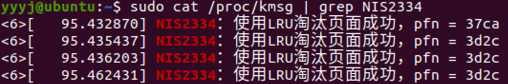
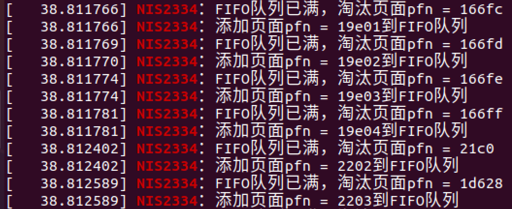

# 实验二 openEuler内存管理——页面淘汰算法 <!-- omit in toc -->

---
## 目录 <!-- omit in toc -->
- [实验背景](#实验背景)
    - [相关知识](#相关知识)
- [实验目的](#实验目的)
- [实验要求](#实验要求)
- [实验环境](#实验环境)
- [实验过程](#实验过程)
    - [1. 必做部分](#1-必做部分)
        - [1.1 重要数据结构](#11-重要数据结构)
        - [1.2 重要函数](#12-重要函数)
        - [1.3 函数调用和依赖关系图](#13-函数调用和依赖关系图)
            - [1.3.1 LRU缓存操作](#131-lru缓存操作)
            - [1.3.2 页面回收操作](#132-页面回收操作)
            - [1.3.3 活动链表和非活动链表的平衡](#133-活动链表和非活动链表的平衡)
        - [1.4 修改内核记录淘汰页面](#14-修改内核记录淘汰页面)
    - [2. 选做部分](#2-选做部分)
        - [2.1 数据结构定义](#21-数据结构定义)
        - [2.2 FIFO算法逻辑实现](#22-fifo算法逻辑实现)
- [参考资料](#参考资料)

---

## 实验背景
- 请求分页系统的基本思想是对每一个运行作业，只装入当前运行需要的一部分页面集合，即"工作集"。如果主存资源紧张，可在原先装入主存的页面中选择一个或多个页，将其换出到辅存中，再把需要的页调入主存。
- 在请求分页系统中，当发现需要的某页内容未被调入主存时，就要通过缺页中断处 理程序调入该页。如果这时主存中还有空闲的页架，那么只需要分配给调入页即可；如果此时主存中所有页架都已分配出去，就只能从已占用的页架中挑选一个页面，将其淘汰，腾出空页架以装入新页。选择需要淘汰的页有不同的算法，包括最优淘汰算法（OPT）、先进先出淘汰算法（FIFO）、最近最少使用淘汰算法（LRU）、最近未使用淘汰算法（NUR）等。

### 相关知识
1. **最优淘汰算法（OPT）**
    - **定义**：也叫最佳置换算法，基本思想是从内存中移出永远不再需要的页面。若无法确定哪些页面永远不再使用，则选择未来最长时间内不会被访问的页面进行淘汰。该算法在实际中难以实现。
    - **实现**：理论上，需要知道进程后续所有的页面访问序列，然后针对当前内存中的页面，找出在后续序列中最晚被访问或者不再被访问的页面进行淘汰

2. **先进先出淘汰算法（FIFO）**
    - **定义**：总是选择驻留内存时间最长的页面进行淘汰，即优先淘汰最早进入内存的页面。其依据是较早调入内存的页面，不再被使用的可能性较大。
    - **实现**：维护一个队列，按照页面进入内存的先后顺序将页面入队。当需要淘汰页面时，直接淘汰队头的页面（即最早进入内存的页面。

3. **最近最少使用淘汰算法（LRU）**
    - **定义**：选择最近最久未使用的页面予以淘汰。该算法基于局部性原理，认为过去一段时间里不曾被访问过的页面，在最近的将来可能也不会再被访问。它充分利用了内存中页面调用的历史信息，比较接近理想的页面置换算法。
    - **实现**：
        - **数组 + 时间戳**：将所有页面放在数组中，每个页面附带一个时间戳记录上次被访问时间。每次访问页面更新时间戳，需淘汰页面时遍历数组找时间戳最大（即最久未被访问 ）的页面淘汰，时间复杂度为O(n) 。
        - **双向链表**：用双向链表存储页面，每次访问页面，将其移动到链表头部。链表尾部的页面就是最近最少使用的，淘汰时删除尾部节点。增删改时间复杂度为O(1) ，查询时间复杂度为O(n) 。 
        - **双向链表 + 哈希表**：哈希表用于快速查找页面，双向链表用于确定访问频次。页面被访问时，通过哈希表快速定位并移到链表头部。空间不足需淘汰时，删除链表尾部页面。这种方式让LRU算法时间复杂度达O(1) ，但空间复杂度会增加，JDK中的LinkedHashMap采用类似方式实现LRU 。

4. **最近未使用淘汰算法（NRU）**
    - **定义**：也叫最近不用调度算法。该算法为每个存储块（页面）设置一个“引用位”和“修改位”，利用这二位组织成四种状态。
    - **实现**：系统为每个页面维护“引用位”和“修改位”。周期性检查页面访问情况更新引用位，需要淘汰页面时，检查各页面的这两个位组合状态。优先淘汰“引用位”为0且“修改位”为0的页面；若不存在，则考虑“引用位”为0且“修改位”为1的页面，以此类推。若多个页面处于相同最低状态值，则按随机或先进先出规则选择淘汰。

## 实验目的
1.  以 openEuler 为例熟悉 Linux 的内存管理代码
2.  掌握 LRU 的实现与拓展

## 实验要求
1. 必做部分
    - 结合自己之前替换的 openEuler 内核版本源代码，（以4.19.90-2403.2.0为例），页面淘汰的源代码在 kernel-4.19.90-2403.2.0/mm/swap.c及其他相关文件中。浏览完整代码并查阅相关资料，写一份报告，包括代码中所实现的算法流程图、重要的变量、数据结构、调用和依赖关系图（必画）等。
    - 修改源代码并重新编译内核，实现功能：记录每次发生页面淘汰时淘汰的页面。报告中需写清修改的代码部分并进行解释，修改过的代码文件需写好注释，实验结果等。
2. 选做部分
    - 修改源代码，在LRU之外，实现其他的页面淘汰算法之一。实现时可以不直接替换LRU，但是需要添加数据结构，在每次页面淘汰时，记录按照自己实现的算法，会淘汰哪个页面。

## 实验环境
- 系统：Ubuntu 20.04.6 LTS
- 平台：Vmware Workstation 17 Pro

## 实验过程
### 1. 必做部分
#### 1.1 重要数据结构
##### 1.1.1 pglist_data 节点<!-- omit in toc -->
这部分定义在 `include/linux/mmzone.h` 中。
```c{.line-numbers}
typedef struct pglist_data {
    struct zone             node_zones[MAX_NR_ZONES];
    struct zonelist         node_zonelists[MAX_ZONELISTS];
    int                     nr_zones;
    /* 省略部分代码 */
    spinlock_t              lru_lock;
    struct lruvec           lruvec;
    unsigned long           flags;
    /* 省略部分代码 */
} pg_data_t;
```
- pglist_data 结构体是 Linux 内核中用于描述 NUMA 节点的结构体，包含了节点的基本信息和一些与内存管理相关的数据结构。
- 其中：
    - `struct zone node_zones[MAX_NR_ZONES]` 是一个数组，表示该节点的所有内存区域.
    - `struct zonelist node_zonelists[MAX_ZONELISTS]` 是一个数组，表示该节点的所有内存区域链表。
    - `int nr_zones` 是该节点的zone数量。
    - `spinlock_t lru_lock` 是用于保护该节点数据结构的自旋锁。
    - `struct lruvec lruvec` 是用于描述 LRU 页面链表的结构体，包含了该节点的 LRU 页面链表和相关的统计信息。
    - `unsigned long flags` 是用于表示该节点的状态和属性的标志位。

##### 1.1.2 zone 区域<!-- omit in toc -->
这部分定义在 `include/linux/mmzone.h` 中。
```c{.line-numbers}
struct zone {
	struct pglist_data	        *zone_pgdat;
	struct per_cpu_pageset      __percpu *pageset;
    /* 省略部分代码 */
	unsigned long		        managed_pages;
	unsigned long		        spanned_pages;
	unsigned long		        present_pages;

	const char		            *name;
    /* 省略部分代码 */
	spinlock_t		            lock;
    /* 省略部分代码 */
} ____cacheline_internodealigned_in_smp;
```
- zone 结构体是 Linux 内核中用于描述内存区域的结构体，包含了该区域的基本信息和一些与内存管理相关的数据结构。
- 其中：
    - `struct pglist_data *zone_pgdat` 是指向该区域所在的 NUMA 节点的指针。
    - `struct per_cpu_pageset __percpu *pageset` 是指向每个 CPU 的页面集的指针，用于管理该区域的页面。
    - `unsigned long managed_pages` 是该区域中已分配的页面数量。
    - `unsigned long spanned_pages` 是该区域中总的页面数量。
    - `unsigned long present_pages` 是该区域中实际存在的页面数量。
    - `const char *name` 是该区域的名称，用于调试和日志输出。
    - `spinlock_t lock` 是用于保护该区域数据结构的自旋锁。


##### 1.1.3 lruvec 结构体和 lru_list 枚举<!-- omit in toc -->
这部分定义在 `include/linux/mmzone.h` 中。
```c{.line-numbers}
#define LRU_BASE 0
#define LRU_ACTIVE 1
#define LRU_FILE 2
enum lru_list {
	LRU_INACTIVE_ANON = LRU_BASE,
	LRU_ACTIVE_ANON = LRU_BASE + LRU_ACTIVE,
	LRU_INACTIVE_FILE = LRU_BASE + LRU_FILE,
	LRU_ACTIVE_FILE = LRU_BASE + LRU_FILE + LRU_ACTIVE,
	LRU_UNEVICTABLE,
	NR_LRU_LISTS
};
/* 省略部分代码 */
struct lruvec {
	struct list_head		        lists[NR_LRU_LISTS];
	struct zone_reclaim_stat	    reclaim_stat;
	/* 省略部分代码 */
	struct pglist_data              *pgdat;
};
```
- lruvec 结构体是 Linux 内核中用于描述 LRU 页面链表的结构体，包含了该节点的 LRU 页面链表和相关的统计信息。
- 其中：
    - `struct list_head lists[NR_LRU_LISTS]` 是一个链表数组，表示该节点的 LRU 页面链表。
    - `struct zone_reclaim_stat reclaim_stat` 是用于描述该区域的回收统计信息的结构体。

    - `struct pglist_data *pgdat` 是指向该区域所在的 NUMA 节点的指针。
- `enum lru_list` 是一个枚举类型，表示 LRU 页面链表的类型，包括非活动匿名页面、活动匿名页面、非活动文件页面和活动文件页面。

##### 1.1.4 page 结构体<!-- omit in toc -->
这部分定义在 `include/linux/mm_types.h` 中。
```c{.line-numbers}
struct page {
	unsigned long flags;		
	union {
		struct {	/* Page cache and anonymous pages */
			/**
			 * @lru: Pageout list, eg. active_list protected by
			 * zone_lru_lock.  Sometimes used as a generic list
			 * by the page owner.
			 */
			struct list_head            lru;
			/* See page-flags.h for PAGE_MAPPING_FLAGS */
			struct address_space        *mapping;
			pgoff_t                     index;		
            /* 省略部分代码 */
		};
		/* 省略部分代码 */
    }
} _struct_page_alignment;
```
- page 结构体是 Linux 内核中用于描述内存页面的结构体，包含了页面的基本信息和一些与内存管理相关的数据结构，是每个 page 的唯一标识与描述。该结构体使用 `union` 联合体复用空间，以节省内存。
- 其中：
    - `unsigned long flags` 是页面的标志位，用于表示页面的状态和属性，有时会用于异步更新状态。
    - `struct list_head lru` 是一个链表节点，用于将页面加入到 LRU 页面链表中（根据不同页面类型加入到不同的链表中，如lru链表或者slab_list链表等）。
    - `struct address_space *mapping` 是指向页面所在的地址空间的指针。
    - `pgoff_t index` 是页面在地址空间中的索引，用于标识页面在地址空间中的位置。

##### 1.1.5 pageflags 枚举<!-- omit in toc -->
这部分定义在 `include/linux/page-flags.h` 中。
```c{.line-numbers}
enum pageflags {
    PG_locked,		/* Page is locked. Don't touch. */
    PG_error,
    PG_referenced,
    PG_uptodate,
    PG_dirty,
    PG_lru,
    PG_active,
    PG_mlocked,
    /* 省略部分代码 */
};
```
- pageflags 是一个枚举类型，表示页面的标志位，包括页面锁定、错误、引用、更新、脏、LRU 和活动等状态，这里只截取了部分有关的标志位。
- 其中：
    - `PG_locked` 表示页面被锁定，不能被访问。
    - `PG_error` 表示页面发生错误。
    - `PG_referenced` 表示页面被引用。
    - `PG_uptodate` 表示页面是最新的。
    - `PG_dirty` 表示页面是脏的，需要写回磁盘。
    - `PG_lru` 表示页面在 LRU 页面链表中。
    - `PG_active` 表示页面处于活动状态。
    - `PG_mlocked` 表示页面被锁定在内存中。
- 这些标志位用于描述页面的状态和属性，帮助内核进行内存管理和页面置换。

##### 1.1.6 pagevec 结构体<!-- omit in toc -->
这部分定义在 `include/linux/pagevec.h` 中。
```c{.line-numbers}
#define PAGEVEC_SIZE	15
/* 省略部分代码 */
struct pagevec {
    unsigned char           nr;
    bool                    percpu_pvec_drained;
    struct page             *pages[PAGEVEC_SIZE];
};
```
- pagevec 结构体用于管理 LRU 缓存中的页面，其中：
    - `pages` 数组用于存储页面指针。
    - `nr` 表示当前数组中存储的页面数量。
    - `percpu_pvec_drained` 用于标记是否已经清空了每个 CPU 的 pagevec。
- 并且，该头文件中定义了宏 `PAGEVEC_SIZE = 15`，表示 pagevec 中页面的最大数量为 15，当一个 pagevec 中存储的页面数量达到 15 时，就需要将其一次性移动到 LRU 链表中并清空 pagevec。
- 这样的设计可以提高 LRU 链表的操作效率，减少对链表的频繁操作，避免大量加锁解锁操作导致冲突和性能下降。

而在 `mm/swap.c` 中，定义了：
```c{.line-numbers}
static DEFINE_PER_CPU(struct pagevec, lru_add_pvec);
static DEFINE_PER_CPU(struct pagevec, lru_rotate_pvecs);
static DEFINE_PER_CPU(struct pagevec, lru_deactivate_file_pvecs);
static DEFINE_PER_CPU(struct pagevec, lru_lazyfree_pvecs);
#ifdef CONFIG_SMP
static DEFINE_PER_CPU(struct pagevec, activate_page_pvecs);
#endif
```
- 即为每个 CPU 定义了五种 pagevec 结构体，分别用于 LRU 链表的添加、不活跃头页移到尾部、活跃文件页移到不活跃文件链表、活跃匿名页移到不活跃匿名页链表以及SMP架构下的活跃页移到活跃页链表。


#### 1.2 重要函数
由于涉及的函数较多，这里只列出部分重要函数进行分析，具体的函数调用关系图和依赖关系图可以参考第三部分图示。
可以通过 `include/linux/swap.h` 中的函数声明来了解这些函数的具体实现和调用关系。
```c{.line-numbers}
/* linux/mm/swap.c */
extern void lru_cache_add(struct page *);
extern void lru_cache_add_anon(struct page *page);
extern void lru_cache_add_file(struct page *page);
extern void lru_add_page_tail(struct page *page, struct page *page_tail, struct lruvec *lruvec, struct list_head *head);
extern void activate_page(struct page *);
extern void mark_page_accessed(struct page *);
extern void lru_add_drain(void);
extern void lru_add_drain_cpu(int cpu);
extern void lru_add_drain_all(void);
extern void rotate_reclaimable_page(struct page *page);
extern void deactivate_file_page(struct page *page);
extern void mark_page_lazyfree(struct page *page);
extern void swap_setup(void);

extern void lru_cache_add_active_or_unevictable(struct page *page, struct vm_area_struct *vma);
```

##### 1.2.1 lru_cache_add 系列函数以及 __lru_cache_add <!-- omit in toc -->
这部分定义在 `mm/swap.c` 中，这里以 `lru_cache_add` 函数为例
```c{.line-numbers}
void lru_cache_add(struct page *page)
{
    VM_BUG_ON_PAGE(PageActive(page) && PageUnevictable(page), page);
    VM_BUG_ON_PAGE(PageLRU(page), page);
    __lru_cache_add(page);
}
```
- `lru_cache_add` 函数用于将页面添加到 LRU 页面链表中。
    - 该函数首先检查页面是否处于活动状态和不可回收状态、以及是否已经在 LRU 链表中，如果是则触发内核错误检查。
    - 最后调用 `__lru_cache_add` 函数将页面添加到 LRU 链表中。

观察可以发现，lru_cache_add 系列函数的实现都是调用了 `__lru_cache_add` 函数，具体如下：
```c{.line-numbers}
static void __lru_cache_add(struct page *page)
{
    struct pagevec *pvec = &get_cpu_var(lru_add_pvec);

    get_page(page);
    if (!pagevec_add(pvec, page) || PageCompound(page))
        __pagevec_lru_add(pvec);
    put_cpu_var(lru_add_pvec);
}
```
- `__lru_cache_add` 函数是将页面添加到 LRU 页面链表的底层函数。
    - 该函数首先获取当前 CPU 的 pagevec 结构体，然后调用 `get_page` 函数增加页面的引用计数。
    - 接着调用 `pagevec_add` 函数将页面添加到 pagevec 中。
    - 如果添加失败或者页面是复合页面，则调用 `__pagevec_lru_add` 函数将 pagevec 中的页面添加到 LRU 链表中。
    - 还使用了 `get_cpu_var` 和 `put_cpu_var` 函数来处理CPU抢占。

其中调用的 `__pagevec_lru_add` 函数定义在 `mm/swap.c` 中：
```c{.line-numbers}
void __pagevec_lru_add(struct pagevec *pvec)
{
    pagevec_lru_move_fn(pvec, __pagevec_lru_add_fn, NULL);
}
EXPORT_SYMBOL(__pagevec_lru_add);
```
- `__pagevec_lru_add` 函数用于将 pagevec 中的页面添加到 LRU 页面链表中。
    - 该函数调用 `pagevec_lru_move_fn` 函数来实现具体的添加操作。
    - `pagevec_lru_move_fn` 函数是一个通用的函数，用于将 pagevec 中的页面移动到指定的链表中。
    - 该函数的第二个参数是一个函数指针，指向具体的添加操作函数 `__pagevec_lru_add_fn`。

##### 1.2.2  pagevec_lru_move_fn <!-- omit in toc -->
前一部分提到的 `pagevec_lru_move_fn` 函数定义在 `mm/swap.c` 中：
```c{.line-numbers}
static void pagevec_lru_move_fn(struct pagevec *pvec,
     void (*move_fn)(struct page *page, struct lruvec *lruvec, void *arg),
     void *arg)
{
    int i;
    struct pglist_data *pgdat = NULL;
    struct lruvec *lruvec;
    unsigned long flags = 0;

    for (i = 0; i < pagevec_count(pvec); i++) {
        struct page *page = pvec->pages[i];
        struct pglist_data *pagepgdat = page_pgdat(page);

        if (pagepgdat != pgdat) {
            if (pgdat)
                spin_unlock_irqrestore(&pgdat->lru_lock, flags);
            pgdat = pagepgdat;
            spin_lock_irqsave(&pgdat->lru_lock, flags);
        }

        lruvec = mem_cgroup_page_lruvec(page, pgdat);
        (*move_fn)(page, lruvec, arg);
    }
    if (pgdat) spin_unlock_irqrestore(&pgdat->lru_lock, flags);
    release_pages(pvec->pages, pvec->nr);
    pagevec_reinit(pvec);
}
```
- `pagevec_lru_move_fn` 函数用于将 pagevec 中的页面移动到指定的链表中。
    - 该函数首先遍历 pagevec 中的所有页面，然后获取页面所在的 NUMA 节点和 LRU 链表。
    - 接着调用传入的第二个参数，即具体操作的函数指针，对每个页面进行操作。
    - 最后释放页面并重新初始化 pagevec。

##### 1.2.3 activate_page <!-- omit in toc -->
这部分定义在 `mm/swap.c` 中。
```c{.line-numbers}
void activate_page(struct page *page)
{
    struct zone *zone = page_zone(page);

    page = compound_head(page);
    spin_lock_irq(zone_lru_lock(zone));
    __activate_page(page, mem_cgroup_page_lruvec(page, zone->zone_pgdat), NULL);
    spin_unlock_irq(zone_lru_lock(zone));
}
```
- `activate_page` 函数用于将页面标记为活动状态。
    - 该函数首先获取页面所在的区域，然后获取页面的复合头。
    - 接着加锁保护 LRU 链表，调用 `__activate_page` 函数将页面标记为活动状态。
    - 最后解锁。

其中调用的 `__activate_page` 函数定义在 `mm/swap.c` 中：
```c{.line-numbers}
static void __activate_page(struct page *page, struct lruvec *lruvec, void *arg)
{
    if (PageLRU(page) && !PageActive(page) && !PageUnevictable(page)) {
        int file = page_is_file_cache(page);
        int lru = page_lru_base_type(page);
        int nr_pages = hpage_nr_pages(page);

        del_page_from_lru_list(page, lruvec, lru);
        SetPageActive(page);
        lru += LRU_ACTIVE;
        add_page_to_lru_list(page, lruvec, lru);
        trace_mm_lru_activate(page);

        __count_vm_events(PGACTIVATE, nr_pages);
        __count_memcg_events(lruvec_memcg(lruvec), PGACTIVATE, nr_pages);
        update_page_reclaim_stat(lruvec, file, 1);
    }
}
```
- `__activate_page` 函数是将页面标记为活动状态的底层函数。
    - 该函数首先检查页面是否已经在 LRU 链表中、是否处于活动状态和不可回收状态，如果是则不进行操作。
    - 接着获取页面的文件类型和 LRU 类型，然后删除页面在 LRU 链表中的节点。
    - 然后设置页面为活动状态，并将页面添加到活动链表中。
    - 最后更新页面回收统计信息。
- 该函数还使用了 `trace_mm_lru_activate` 函数来记录页面激活的事件，并使用 `__count_vm_events` 和 `__count_memcg_events` 函数来更新页面活动事件的计数器。

##### 1.2.4 lru_add_drain 系列函数<!-- omit in toc -->
这部分定义在 `mm/swap.c` 中。
```c{.line-numbers}
void lru_add_drain(void)
{
    lru_add_drain_cpu(get_cpu());
    put_cpu();
}

void lru_add_drain_cpu(int cpu)
{
    struct pagevec *pvec = &per_cpu(lru_add_pvec, cpu);
    if (pagevec_count(pvec))
        __pagevec_lru_add(pvec);

    pvec = &per_cpu(lru_rotate_pvecs, cpu);
    if (pagevec_count(pvec)) {
        unsigned long flags;
        /* No harm done if a racing interrupt already did this */
        local_irq_save(flags);
        pagevec_move_tail(pvec);
        local_irq_restore(flags);
    }

    pvec = &per_cpu(lru_deactivate_file_pvecs, cpu);
    if (pagevec_count(pvec))
        pagevec_lru_move_fn(pvec, lru_deactivate_file_fn, NULL);

    pvec = &per_cpu(lru_lazyfree_pvecs, cpu);
    if (pagevec_count(pvec))
        pagevec_lru_move_fn(pvec, lru_lazyfree_fn, NULL);

    activate_page_drain(cpu);
}
```
- `lru_add_drain` 函数用于清空每个 CPU 的 pagevec，并将其添加到 LRU 链表中，其实际上调用的是 `__pagevec_lru_add` 函数.
- `lru_add_drain_cpu` 函数用于清空指定 CPU 的 pagevec，并将其添加到 LRU 链表中。
    - 该函数首先获取当前 CPU 的 pagevec，然后检查 pagevec 中是否有页面，如果有则调用 `__pagevec_lru_add` 函数将其添加到 LRU 链表中。
    - 接着获取 `lru_rotate_pvecs` 和 `lru_deactivate_file_pvecs` 的 pagevec，分别调用 `pagevec_move_tail` 和 `pagevec_lru_move_fn` 函数将其移动到 LRU 链表中。
    - 最后调用 `activate_page_drain` 函数清空活跃页面的 pagevec。

##### 1.2.5 rotate_reclaimable_page <!-- omit in toc -->
这部分定义在 `mm/swap.c` 中。
```c{.line-numbers}
void rotate_reclaimable_page(struct page *page)
{
    if (!PageLocked(page) && !PageDirty(page) &&
        !PageUnevictable(page) && PageLRU(page)) {
        struct pagevec *pvec;
        unsigned long flags;

        get_page(page);
        local_irq_save(flags);
        pvec = this_cpu_ptr(&lru_rotate_pvecs);
        if (!pagevec_add(pvec, page) || PageCompound(page))
            pagevec_move_tail(pvec);
        local_irq_restore(flags);
    }
}
```
- `rotate_reclaimable_page` 函数用于脏页回写。
    - 该函数首先检查页面是否被锁定、是否脏、是否不可回收和是否在 LRU 链表中，如果是则不进行操作。
    - 其余执行过程的逻辑和 `lru_cache_add` 相同，但是调用的是 `pagevec_move_tail` 函数将页面移动到 LRU 链表尾部。
    - `pagevec_move_tail` 函数调用了 `pagevec_lru_move_fn` 函数，详细过程参考前文 1.2.2 的 `pagevec_lru_move_fn` 函数。

##### 1.2.6 deactivate_file_page <!-- omit in toc -->
这部分定义在 `mm/swap.c` 中。
```c{.line-numbers}
void deactivate_file_page(struct page *page)
{
    /*
    * In a workload with many unevictable page such as mprotect,
    * unevictable page deactivation for accelerating reclaim is pointless.
    */
    if (PageUnevictable(page))
        return;

    if (likely(get_page_unless_zero(page))) {
        struct pagevec *pvec = &get_cpu_var(lru_deactivate_file_pvecs);

        if (!pagevec_add(pvec, page) || PageCompound(page))
            pagevec_lru_move_fn(pvec, lru_deactivate_file_fn, NULL);
        put_cpu_var(lru_deactivate_file_pvecs);
    }
}
```
- `deactivate_file_page` 函数用于将文件页面标记为非活跃状态。
    - 该函数首先检查页面是否不可回收，如果是则不进行操作。
    - 其余执行过程的逻辑和前者相似，但是 `pagevec_lru_move_fn` 内部调用的是 `lru_deactivate_file_fn` 函数，用于将页面移动到非活跃链表中。

##### 1.2.7 mark_page_lazyfree <!-- omit in toc -->
这部分定义在 `mm/swap.c` 中。
```c{.line-numbers}
void mark_page_lazyfree(struct page *page)
{
    if (PageLRU(page) && PageAnon(page) && PageSwapBacked(page) &&
        !PageSwapCache(page) && !PageUnevictable(page)) {
        struct pagevec *pvec = &get_cpu_var(lru_lazyfree_pvecs);

        get_page(page);
        if (!pagevec_add(pvec, page) || PageCompound(page))
            pagevec_lru_move_fn(pvec, lru_lazyfree_fn, NULL);
        put_cpu_var(lru_lazyfree_pvecs);
    }
}
```
- `mark_page_lazyfree` 函数用于将页面标记为懒惰释放状态。
    - 该函数首先检查页面是否在 LRU 链表中、是否是匿名页面、是否被交换、是否在交换缓存中和是否不可回收，如果是则不进行操作。
    - 其余执行过程的逻辑和前者相似，但是 `pagevec_lru_move_fn` 内部调用的是 `lru_lazyfree_fn` 函数，用于将页面移动到懒惰释放链表中。

##### 1.2.8 shrink_node <!-- omit in toc -->
这部分定义在 `mm/vmscan.c` 中，该函数较长，这里只截取部分代码。
```c{.line-numbers}
static bool shrink_node(pg_data_t *pgdat, struct scan_control *sc)
{
    struct reclaim_state *reclaim_state = current->reclaim_state;
    unsigned long nr_reclaimed, nr_scanned;
    bool reclaimable = false;
    /* 省略部分代码 */
    do {
        /* 省略部分代码 */
        memcg = mem_cgroup_iter(root, NULL, &reclaim);
        do {
            /* 省略部分代码 */
            reclaimed = sc->nr_reclaimed;
            scanned = sc->nr_scanned;
            shrink_node_memcg(pgdat, memcg, sc, &lru_pages);
            node_lru_pages += lru_pages;

            if (!sc->no_shrink_slab)
                shrink_slab(sc->gfp_mask, pgdat->node_id, memcg, sc->priority);
            /* 省略部分代码 */
        }while ((memcg = mem_cgroup_iter(root, memcg, &reclaim)));
        /* 省略部分代码 */
    }while (should_continue_reclaim(pgdat, sc->nr_reclaimed - nr_reclaimed, sc));
    /* 省略部分代码 */
}
```
- `shrink_node` 函数用于回收节点中的页面，使用某种策略来扫描节点的lruvec中的lru链表，回收不活跃的页面。函数的核心是两层 `do-while` 循环，遍历目标内存控制组(mem_cgroup)，尝试回收页面。对于符合条件的内存控制组，函数调用 `shrink_node_memcg` 函数来回收页面。
- 该函数使用的内存回收策略是：
    - 优先扫描不活跃的链表，确定可以淘汰的页面；
    - 如果淘汰这部分的页面不够，则转去扫描活跃链表，把其中不太常用的部分放到不活跃链表；
    - 之后再重复第一步，扫描不活跃链表。
- 该函数的实现较为复杂，涉及到多个参数和状态的判断，具体的实现可以参考源代码。

##### 1.2.9 shrink_node_memcg <!-- omit in toc -->
`shrink_node_memcg` 函数是 `shrink_node` 函数最重要的一个调用，用于回收内存控制组中的页面。
```c{.line-numbers}
static void shrink_node_memcg(struct pglist_data *pgdat, struct mem_cgroup *memcg,
                   struct scan_control *sc, unsigned long *lru_pages)
{
    struct lruvec *lruvec = mem_cgroup_lruvec(pgdat, memcg);
    /* 省略部分代码 */
    blk_start_plug(&plug);
    while (nr[LRU_INACTIVE_ANON] || nr[LRU_ACTIVE_FILE] || nr[LRU_INACTIVE_FILE]) {
        unsigned long nr_anon, nr_file, percentage;
        unsigned long nr_scanned;

        for_each_evictable_lru(lru) {
            if (nr[lru]) {
                nr_to_scan = min(nr[lru], SWAP_CLUSTER_MAX);
                nr[lru] -= nr_to_scan;
                nr_reclaimed += shrink_list(lru, nr_to_scan, lruvec, sc);
            }
        }
        /* 省略部分代码 */
    }
    /* 省略部分代码 */
    if (inactive_list_is_low(lruvec, false, sc, true))
        shrink_active_list(SWAP_CLUSTER_MAX, lruvec, sc, LRU_ACTIVE_ANON);
}
```
- `shrink_node_memcg` 函数用于回收内存控制组中的页面。
    - 该函数首先获取 LRU 链表，然后获取当前扫描的页面数量和目标页面数量。
    - 在 while 循环中，函数会逐步扫描和回收 LRU 列表中的页，使用 `for_each_evictable_lru` 宏遍历可回收的 LRU 链表，调用 `shrink_list` 函数实际执行回收操作。
    - 此外，函数还实现了活跃列表再平衡：即使没有回收匿名页，函数也会检查匿名页的活跃/非活跃列表是否需要重新平衡并选择性调用 `shrink_active_list` 进行调整。

##### 1.2.10 shrink_list <!-- omit in toc -->
`shrink_list` 函数是在匿名页的活跃/非活跃列表需要平衡时调用的函数。
```c{.line-numbers}
static unsigned long shrink_list(enum lru_list lru, unsigned long nr_to_scan,
                  struct lruvec *lruvec, struct scan_control *sc)
{
    if (is_active_lru(lru)) {
        if (inactive_list_is_low(lruvec, is_file_lru(lru), sc, true))
            shrink_active_list(nr_to_scan, lruvec, sc, lru);
        return 0;
    }
    return shrink_inactive_list(nr_to_scan, lruvec, sc, lru);
}
```
- `shrink_list` 函数用于回收 LRU 链表中的页面。
    - 该函数首先检查 LRU 链表是否是活动链表，如果是并且非活跃链表页面比较少，则调用 `shrink_active_list` 函数进行回收。
    - 如果是非活动链表，则调用 `shrink_inactive_list` 函数进行回收。

##### 1.2.11 shrink_active_list 和 shrink_inactive_list <!-- omit in toc -->
这两个函数分别用于回收活跃链表和非活跃链表中的页面，代码较长，这里不列出，具体实现可以参考源代码。
- `shrink_active_list` 函数从活动页列表中隔离一定数量的页（nr_to_scan），并根据页面的使用情况将它们重新分类为活动页或非活动页（inactive pages），从而将不常用的页面移到非活动列表中。
- `shrink_inactive_list` 函数通过隔离和加锁保护LRU数据结构，并对隔离出来的页面调用 `shrink_page_list` 函数进行实际回收操作。

##### 1.2.12 shrink_page_list <!-- omit in toc -->
这部分定义在 `mm/vmscan.c` 中，代码较长，这里只截取部分代码。
```c{.line-numbers}
static unsigned long shrink_page_list(struct list_head *page_list,
                       struct pglist_data *pgdat,
                       struct scan_control *sc,
                       enum ttu_flags ttu_flags,
                       struct reclaim_stat *stat,
                       bool force_reclaim)
{
    LIST_HEAD(ret_pages);
    LIST_HEAD(free_pages);
    /* 省略部分代码 */
    while (!list_empty(page_list)) {
        /* 省略部分代码 */
    }
    /* 省略部分代码 */
    return nr_reclaimed;
}
```
- `shrink_page_list` 函数用于回收页面列表中的页面，根据页面的状态（如是否脏页、是否正在写回、是否映射到用户空间等）决定如何处理这些页面。
    - 对于干净的页面，调用 `try_to_unmap` 函数尝试解除页面映射，文件页释放huffer之后释放，匿名页可以直接释放。
    - 对于脏文件页，调用 `try_to_unmap` 函数尝试解除页面映射，异步回写并且加入非活跃文件链表头，回写完放入非活跃文件链表尾部，快速回收。
    - 对于脏匿名页，先加入 `PageSwapCache`，然后调用 `try_to_unmap` 函数尝试解除页面映射，异步回写并且加入非活跃匿名链表头，回写完放入非活跃匿名链表尾部，擦除cache并快速回收。

#### 1.3 函数调用和依赖关系图
##### 1.3.1 LRU缓存操作


##### 1.3.2 页面回收操作


##### 1.3.3 活动链表和非活动链表的平衡


- Another version of the diagram:


#### 1.4 修改内核记录淘汰页面
根据前文分析，在淘汰页面时，函数调用 `shrink_active_list` 和 `shrink_inactive_list` 函数时，都会调用 `free_unref_page_list` 函数来释放页面，接着看其调用，会发现最终调用的是 `__free_one_page` 函数。

该函数定义在 `mm/page_alloc.c` 中，原型如下：
```c{.line-numbers}
static inline void __free_one_page(struct page *page, unsigned long pfn,
				   struct zone *zone, unsigned int order,
				   int migratetype, fpi_t fpi_flags)
{
	unsigned long combined_pfn;
	unsigned long uninitialized_var(buddy_pfn);
	struct page *buddy;
	unsigned int max_order;
    /* 省略后续代码 */
}

```
- 其中，`page` 为要释放的页面指针，`pfn` 为页面帧号，`zone` 为页面所在的区域。

因此，只要在此函数中增加输出信息即可实现记录淘汰页面的功能。查询资料，发现可以使用封装好的函数`prinfo`，该函数是对 `printk` 函数日志级别为 `KERN_INFO` 的封装，因此修改`__free_one_page` 函数如下：
```c{.line-numbers}
static inline void __free_one_page(struct page *page, unsigned long pfn,
                   struct zone *zone, unsigned int order,
                   int migratetype, fpi_t fpi_flags)
{
    unsigned long combined_pfn;
    unsigned long uninitialized_var(buddy_pfn);
    struct page *buddy;
    unsigned int max_order;
    pr_info("NIS2334：使用LRU淘汰页面成功，pfn = %lx\n", pfn);
    /* 省略后续代码 */
}
```
修改后编译内核，安装模块和内核：
```bash
make -j8
sudo make modules_install
sudo make install
```
之后重启系统，按住 `Shift` 键进入按进入引导菜单，选择`Ubuntu 的高级选项`，选择新安装的内核版本启动系统。

由于 `pr_info` 会在内核日志中输出信息，因此可以使用下面的命令查看内核日志：
```bash
dmesg | grep NIS2334
```
或者使用：
```bash
sudo cat /proc/kmsg | grep NIS2334
```
在运行时查看内核日志，找到淘汰页面的页面帧号。结果如下：



### 2. 选做部分
这里选用最简单的FIFO算法来实现页面置换算法，具体实现如下：
#### 2.1 数据结构定义
在 `include/linux/` 目录下新建一个 `fifo.h` 文件，定义 FIFO 链表结构体和 FIFO 头指针：
```c{.line-numbers}
#ifndef FIFO_H
#define FIFO_H
#include <linux/list.h>
#include <linux/spinlock.h>
#define FIFO_SIZE 1024 // 定义FIFO队列的大小

struct fifo_list {
    unsigned long pages[FIFO_SIZE]; // FIFO队列的页面帧号数组
    int head; // 队列头指针
    int tail; // 队列尾指针
    spinlock_t lock; // 自旋锁，用于保护FIFO队列的并发访问
};

extern struct fifo_list fifo; // FIFO队列的全局变量
void add_fifo_page(unsigned long pfn); // 添加页面到FIFO队列
#endif /* FIFO_H */
```
- `fifo_list` 结构体定义了 FIFO 队列的大小、队列头指针、队列尾指针和自旋锁。
- 其中：
    - `pages` 数组用于存储页面帧号
    - `head` 和 `tail` 分别表示队列的头和尾指针
    - `lock` 用于保护 FIFO 队列的并发访问。

#### 2.2 FIFO算法逻辑实现
在 `mm/mm_init.c` 中添加 FIFO 链表的初始化函数：
```c{.line-numbers}
#include <linux/fifo.h>

/* mm_init.c 中原本的代码 */

struct fifo_list fifo; // FIFO队列的全局变量
void init_fifo(void) {
    spin_lock_init(&fifo.lock); // 初始化自旋锁
    fifo.head = 0; // 初始化队列头指针
    fifo.tail = 0; // 初始化队列尾指针
    memset(fifo.pages, 0, sizeof(fifo.pages)); // 初始化FIFO队列
    // 其他内存管理初始化代码
}
```
- `init_fifo` 函数用于初始化 FIFO 队列，包括初始化自旋锁、队列头指针和队列尾指针，以及清空 FIFO 队列。

在 `mm/page_alloc.c` 中添加 FIFO 链表的添加函数：
```c{.line-numbers}
#include <linux/fifo.h>
void add_fifo_page(unsigned long pfn) {
    unsigned long flags;
    spin_lock_irqsave(&fifo.lock, flags); // 加锁FIFO队列
    if ((fifo.tail + 1) % FIFO_SIZE == fifo.head) { // 如果队列已满，更新队头指针
        pr_info("NIS2334：FIFO队列已满，淘汰页面pfn = %lx\n", fifo.pages[fifo.head]);
        fifo.head = (fifo.head + 1) % FIFO_SIZE;
    }
    fifo.pages[fifo.tail] = pfn; // 添加页面到FIFO队列
    fifo.tail = (fifo.tail + 1) % FIFO_SIZE; // 更新队列尾指针
    if (fifo.tail == fifo.head) { // 如果队列已满，更新队头指针
        fifo.head = (fifo.head + 1) % FIFO_SIZE;
    }
    spin_unlock_irqrestore(&fifo.lock, flags); // 解锁FIFO队列
    pr_info("NIS2334：添加页面pfn = %lx到FIFO队列\n", pfn); // 打印添加页面的信息
}
/* mm/page_alloc.c 中原本的代码 */
```
- `add_fifo_page` 函数用于将页面添加到 FIFO 队列中，由于 FIFO 队列是循环队列，因此需要使用取模运算来更新队列头和尾指针，此函数同时实现 FIFO 队列的添加与淘汰功能。
    - 该函数首先加锁保护 FIFO 队列，然后检查队列是否已满，如果已满则更新队头指针。
    - 接着将页面添加到 FIFO 队列中，并更新队列尾指针。
    - 最后解锁 FIFO 队列。
- 使用 `pr_info` 函数打印添加页面的信息。

具体的FIFO算法实现在 `mm/fifo.c` 中，代码较长，此处不列出。

同时，需要在 `mm/page_alloc.c` 中的 `__alloc_pages_nodemask` 函数中添加 FIFO 链表的调用：
```c{.line-numbers}
/* mm/page_alloc.c 中原本的代码 */
struct page *__alloc_pages_nodemask(gfp_t gfp_mask, unsigned int order,
                     int preferred_nid, nodemask_t *nodemask)
{
    struct page *page = NULL;
    unsigned int alloc_flags = ALLOC_WMARK_LOW;
    gfp_t alloc_mask; /* The gfp_t that was actually used for allocation */
    struct alloc_context ac = {};

    /*
    * There are several places where we assume that the order value is sane
    * so bail out early if the request is out of bound.
    */
    if (WARN_ON_ONCE_GFP(order >= MAX_ORDER, gfp_mask))
        return NULL;

    prepare_before_alloc(&gfp_mask);

retry:
    alloc_mask = gfp_mask;
    if (!prepare_alloc_pages(gfp_mask, order, preferred_nid, nodemask, &ac,
                &alloc_mask, &alloc_flags))
        return NULL;

    finalise_ac(gfp_mask, &ac);

    /* Dynamic hugetlb allocation attemp */
    if (dhugetlb_enabled && likely(order == 0)) {
        page = alloc_page_from_dhugetlb_pool(gfp_mask);
        if (page) {
            prep_new_page(page, order, gfp_mask, alloc_flags);
            goto out;
        }
    }

    /* First allocation attempt */
    page = get_page_from_freelist(alloc_mask, order, alloc_flags, &ac);
    if (likely(page)) {
        add_page_fifo(page_to_pfn(page)); // 添加页面到FIFO队列
        goto out;
    }
    /*
    * Apply scoped allocation constraints. This is mainly about GFP_NOFS
    * resp. GFP_NOIO which has to be inherited for all allocation requests
    * from a particular context which has been marked by
    * memalloc_no{fs,io}_{save,restore}.
    */
    alloc_mask = current_gfp_context(gfp_mask);
    ac.spread_dirty_pages = false;

    /*
    * Restore the original nodemask if it was potentially replaced with
    * &cpuset_current_mems_allowed to optimize the fast-path attempt.
    */
    if (unlikely(ac.nodemask != nodemask))
        ac.nodemask = nodemask;

    page = __alloc_pages_slowpath(alloc_mask, order, &ac);

    if (page) {
        add_page_fifo(page_to_pfn(page)); // 添加页面到FIFO队列
    }

out:
    if (memcg_kmem_enabled() && (gfp_mask & __GFP_ACCOUNT) && page &&
        unlikely(__memcg_kmem_charge(page, gfp_mask, order) != 0)) {
        __free_pages(page, order);
        page = NULL;
    }

    if (check_after_alloc(&gfp_mask, order, preferred_nid, nodemask, &page))
        goto retry;

    trace_mm_page_alloc(page, order, alloc_mask, ac.migratetype);

    return page;
}
EXPORT_SYMBOL(__alloc_pages_nodemask);
/* mm/page_alloc.c 中原本的代码 */
```

编译内核，安装模块和内核，运行结果如下：



## 参考资料
---
[The Linux Kernel](https://www.kernel.org/doc/html/latest/translations/zh_CN/core-api/printk-basics.html)
[linux内存源码分析 - 内存回收(lru链表)](https://www.cnblogs.com/tolimit/p/5447448.html)
[深入理解Linux内存管理（七）内存回收](https://zhuanlan.zhihu.com/p/480428225)
[循环队列FIFO原理及C实现](https://www.cnblogs.com/fuzidage/p/15163399.html)